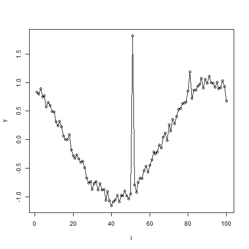

Objetivo: Aumentar dados priorizando amostras mais recentes (recency awareness) para dar mais peso a padrões recentes nas janelas.


``` r
# Instalando o pacote (se necessário)
install.packages("tspredit")
```


``` r
# Carregando os pacotes
library(daltoolbox)
library(tspredit) 
```


``` r
# Série cosseno com ruído para estudo

i <- seq(0, 2*pi+8*pi/50, pi/50)
x <- cos(i)
noise <- rnorm(length(x), 0, sd(x)/10)

x <- x + noise
x[30] <-rnorm(1, 0, sd(x))

x[60] <-rnorm(1, 0, sd(x))

x[90] <-rnorm(1, 0, sd(x))

options(repr.plot.width=6, repr.plot.height=5)  
par(mfrow = c(1, 1))
plot(i, x)
lines(i, x)
```


``` r
# Janelas deslizantes

sw_size <- 10
xw <- ts_data(x, sw_size)
i <- 1:nrow(xw)
y <- xw[,sw_size]

plot(i, y)
lines(i, y)
```




``` r
# Aumentação (awareness)

filter <- ts_aug_awareness(0.25)
xa <- transform(filter, xw)
idx <- attr(xa, "idx")
```


``` r
# Gráfico (original vs janelas aumentadas)

plot(x = i, y = y, main = "cosine")
lines(x = i, y = y, col="black")
for (j in 1:nrow(xa)) {
lines(x = (idx[j]-sw_size+1):idx[j], y = xa[j,1:sw_size], col="green")
}
```


