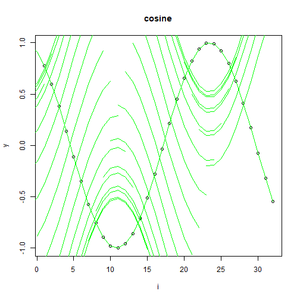

Objetivo: Demonstrar a aumentação do tipo flip (espelhar janelas em torno da média), gerando variações simétricas de padrões locais.


``` r
# Aumentação de séries temporais - flip

# Instalando o pacote (se necessário)
install.packages("tspredit")
```


``` r
# Carregando os pacotes
library(daltoolbox)
library(tspredit) 
```


``` r
# Série para estudo

data(tsd)
library(ggplot2)
```

```
## Learn more about the underlying theory at https://ggplot2-book.org/
```

``` r
plot_ts(x=tsd$x, y=tsd$y) + theme(text = element_text(size=16))
```


``` r
# Janelas deslizantes

sw_size <- 10
xw <- ts_data(tsd$y, sw_size)
```


``` r
# Aumentação (flip)

augment <- ts_aug_flip()
augment <- fit(augment, xw)
xa <- transform(augment, xw)
idx <- attr(xa, "idx")
ts_head(xa)
```

```
##             t9        t8        t7        t6        t5        t4        t3        t2         t1         t0
## [1,] 0.0000000 0.2474040 0.4794255 0.6816388 0.8414710 0.9489846 0.9974950 0.9839859  0.9092974  0.7780732
## [2,] 0.2474040 0.4794255 0.6816388 0.8414710 0.9489846 0.9974950 0.9839859 0.9092974  0.7780732  0.5984721
## [3,] 0.4794255 0.6816388 0.8414710 0.9489846 0.9974950 0.9839859 0.9092974 0.7780732  0.5984721  0.3816610
## [4,] 0.6816388 0.8414710 0.9489846 0.9974950 0.9839859 0.9092974 0.7780732 0.5984721  0.3816610  0.1411200
## [5,] 0.8414710 0.9489846 0.9974950 0.9839859 0.9092974 0.7780732 0.5984721 0.3816610  0.1411200 -0.1081951
## [6,] 0.9489846 0.9974950 0.9839859 0.9092974 0.7780732 0.5984721 0.3816610 0.1411200 -0.1081951 -0.3507832
```


``` r
# Gráfico (original vs janelas aumentadas)

i <- 1:nrow(xw)
y <- xw[,sw_size]
plot(x = i, y = y, main = "cosine")
lines(x = i, y = y, col="black")
for (j in 1:nrow(xa)) {
  lines(x = (idx[j]-sw_size+1):idx[j], y = xa[j,1:sw_size], col="green")
}
```



