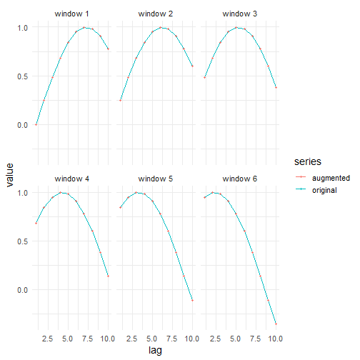

## No Augmentation

About the technique
- `ts_aug_none()` leaves the training windows unchanged.
- Its value is methodological: it gives you the baseline needed to judge whether synthetic windows are actually helping the predictor.

Didactic goal: establish the reference case before testing any augmentation strategy.


``` r
source(url("https://raw.githubusercontent.com/cefet-rj-dal/tspredit/main/examples/seed.R"))
# Time series augmentation - none (identity)

# Installing the package (if needed)
#install.packages("tspredit")
```

We start by loading the packages used throughout this example.


``` r
# Loading the packages
library(daltoolbox)
library(tspredit) 
```


We load the example series that will be used throughout the demonstration.


``` r
# Series for study

data(tsd)
library(ggplot2)
plot_ts(x=tsd$x, y=tsd$y) + theme(text = element_text(size=16))
```


The next step organizes the series into sliding windows, which is the tabular representation used by the later transformations and models.


``` r
# Sliding windows

sw_size <- 10
xw <- ts_data(tsd$y, sw_size)
```

Now we augmentation (none).


``` r
# Augmentation (none)

augment <- ts_aug_none()
set_example_seed()
augment <- fit(augment, xw)
xa <- transform(augment, xw)
idx <- attr(xa, "idx")
ts_head(xa)
```

```
##             t9        t8        t7        t6        t5        t4        t3
## [1,] 0.0000000 0.2474040 0.4794255 0.6816388 0.8414710 0.9489846 0.9974950
## [2,] 0.2474040 0.4794255 0.6816388 0.8414710 0.9489846 0.9974950 0.9839859
## [3,] 0.4794255 0.6816388 0.8414710 0.9489846 0.9974950 0.9839859 0.9092974
## [4,] 0.6816388 0.8414710 0.9489846 0.9974950 0.9839859 0.9092974 0.7780732
## [5,] 0.8414710 0.9489846 0.9974950 0.9839859 0.9092974 0.7780732 0.5984721
## [6,] 0.9489846 0.9974950 0.9839859 0.9092974 0.7780732 0.5984721 0.3816610
##             t2         t1         t0
## [1,] 0.9839859  0.9092974  0.7780732
## [2,] 0.9092974  0.7780732  0.5984721
## [3,] 0.7780732  0.5984721  0.3816610
## [4,] 0.5984721  0.3816610  0.1411200
## [5,] 0.3816610  0.1411200 -0.1081951
## [6,] 0.1411200 -0.1081951 -0.3507832
```

This plot overlays the original and augmented windows so you can see how the transformation changes the local shape.


``` r
# Plot a few representative windows on the lag axis
compare_rows <- seq_len(min(nrow(xa), 6))
comparison <- do.call(
  rbind,
  lapply(compare_rows, function(row_id) {
    source_row <- idx[row_id]
    rbind(
      data.frame(lag = seq_len(sw_size), value = as.numeric(xw[source_row, 1:sw_size]), series = "original", sample = paste("window", source_row)),
      data.frame(lag = seq_len(sw_size), value = as.numeric(xa[row_id, 1:sw_size]), series = "augmented", sample = paste("window", source_row))
    )
  })
)

ggplot(comparison, aes(x = lag, y = value, color = series, group = series)) +
  geom_line(linewidth = 0.7) +
  geom_point(size = 1.2) +
  facet_wrap(~ sample, ncol = 3) +
  theme_minimal(base_size = 14)
```



References
- H. I. Fawaz, G. Forestier, J. Weber, L. Idoumghar, and P.-A. Muller (2019). Deep learning for time series classification: A review. Data Mining and Knowledge Discovery, 33, 917–963.

