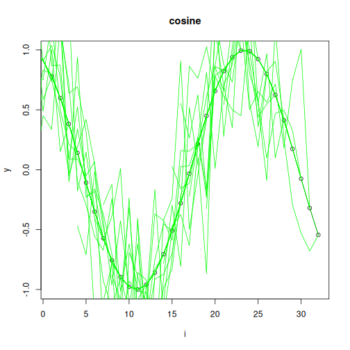

## Jitter Augmentation

About the technique
- Jitter augmentation adds small random perturbations to each window.
- It is useful when the predictor should become less sensitive to minor measurement noise while preserving the overall local pattern.

Didactic goal: see how a simple stochastic perturbation can enlarge the training set without changing the forecasting workflow.


``` r
source(url("https://raw.githubusercontent.com/cefet-rj-dal/tspredit/main/examples/seed.R"))
# Time series augmentation - jitter

# Installing the package (if needed)
#install.packages("tspredit")
```

We start by loading the packages used throughout this example.


``` r
# Loading the packages
library(daltoolbox)
library(tspredit) 
```


We load the example series that will be used throughout the demonstration.


``` r
# Series for study

data(tsd)
library(ggplot2)
plot_ts(x=tsd$x, y=tsd$y) + theme(text = element_text(size=16))
```


The next step organizes the series into sliding windows, which is the tabular representation used by the later transformations and models.


``` r
# Sliding windows

sw_size <- 10
xw <- ts_data(tsd$y, sw_size)
```

Now we augmentation (jitter).


``` r
# Augmentation (jitter)

augment <- ts_aug_jitter()
set_example_seed()
augment <- fit(augment, xw)
xa <- transform(augment, xw)
idx <- attr(xa, "idx")
ts_head(xa)
```

```
##             t9        t8        t7        t6        t5        t4        t3        t2         t1         t0
## [1,] 0.0000000 0.2474040 0.4794255 0.6816388 0.8414710 0.9489846 0.9974950 0.9839859  0.9092974  0.7780732
## [2,] 0.2474040 0.4794255 0.6816388 0.8414710 0.9489846 0.9974950 0.9839859 0.9092974  0.7780732  0.5984721
## [3,] 0.4794255 0.6816388 0.8414710 0.9489846 0.9974950 0.9839859 0.9092974 0.7780732  0.5984721  0.3816610
## [4,] 0.6816388 0.8414710 0.9489846 0.9974950 0.9839859 0.9092974 0.7780732 0.5984721  0.3816610  0.1411200
## [5,] 0.8414710 0.9489846 0.9974950 0.9839859 0.9092974 0.7780732 0.5984721 0.3816610  0.1411200 -0.1081951
## [6,] 0.9489846 0.9974950 0.9839859 0.9092974 0.7780732 0.5984721 0.3816610 0.1411200 -0.1081951 -0.3507832
```

This plot overlays the original and augmented windows so you can see how the transformation changes the local shape.


``` r
# Plot (original vs augmented windows)

i <- 1:nrow(xw)
y <- xw[,sw_size]
plot(x = i, y = y, main = "cosine")
lines(x = i, y = y, col="black")
for (j in 1:nrow(xa)) {
  lines(x = (idx[j]-sw_size+1):idx[j], y = xa[j,1:sw_size], col="green")
}
```



References
- T. T. Um et al. (2017). Data augmentation of wearable sensor data for Parkinson’s disease monitoring using convolutional neural networks. ACM ICMI.
- H. I. Fawaz, G. Forestier, J. Weber, L. Idoumghar, and P.-A. Muller (2019). Deep learning for time series classification: A review. Data Mining and Knowledge Discovery, 33, 917–963.

