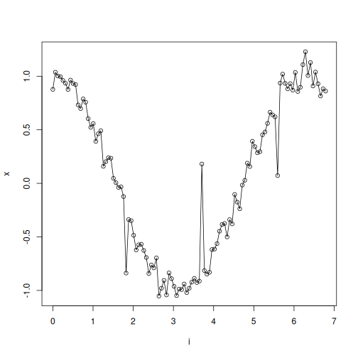
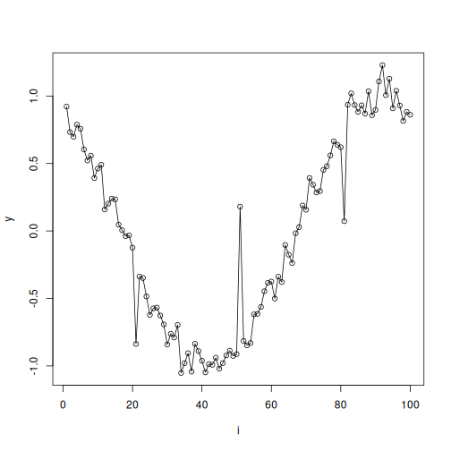
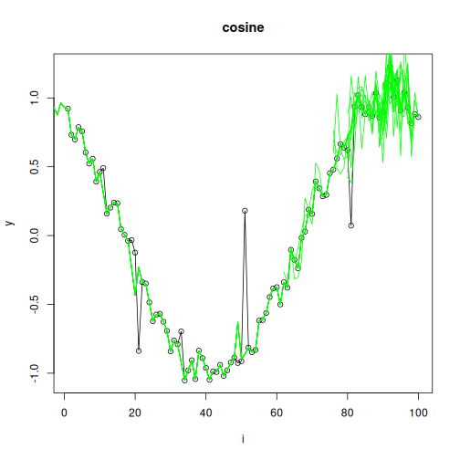

## Recency-Aware Smoothing Augmentation

About the technique
- This augmentation combines recency awareness with smoothing.
- It favors recent windows while reducing short-term noise, which is useful when the latest regime matters most but is still noisy.

Didactic goal: study a hybrid augmentation that changes both sample emphasis and local smoothness.


``` r
source(url("https://raw.githubusercontent.com/cefet-rj-dal/tspredit/main/examples/seed.R"))
# Installing the package (if needed)
#install.packages("tspredit")
```

We start by loading the packages used throughout this example.


``` r
# Loading the packages
library(daltoolbox)
library(tspredit) 
```


This chunk cosine series with noise for study.


``` r
# Cosine series with noise for study

i <- seq(0, 2*pi+8*pi/50, pi/50)
x <- cos(i)
noise <- rnorm(length(x), 0, sd(x)/10)

x <- x + noise
x[30] <- rnorm(1, 0, sd(x))

x[60] <- rnorm(1, 0, sd(x))

x[90] <- rnorm(1, 0, sd(x))


options(repr.plot.width=6, repr.plot.height=5)  
par(mfrow = c(1, 1))
plot(i, x)
lines(i, x)
```



The next step organizes the series into sliding windows, which is the tabular representation used by the later transformations and models.


``` r
# Sliding windows

sw_size <- 10
xw <- ts_data(x, sw_size)
i <- 1:nrow(xw)
y <- xw[,sw_size]

plot(i, y)
lines(i, y)
```



Now we augmentation (awareness + smoothing).


``` r
# Augmentation (awareness + smoothing)

filter <- tspredit::ts_aug_awaresmooth(0.25)
xa <- transform(filter, xw)
idx <- attr(xa, "idx")
```

This plot overlays the original and augmented windows so you can see how the transformation changes the local shape.


``` r
# Plot (original vs augmented windows)

plot(x = i, y = y, main = "cosine")
lines(x = i, y = y, col="black")
for (j in 1:nrow(xa)) {
  lines(x = (idx[j]-sw_size+1):idx[j], y = xa[j,1:sw_size], col="green")
}
```



References
- H. I. Fawaz, G. Forestier, J. Weber, L. Idoumghar, and P.-A. Muller (2019). Deep learning for time series classification: A review. Data Mining and Knowledge Discovery, 33, 917–963.

