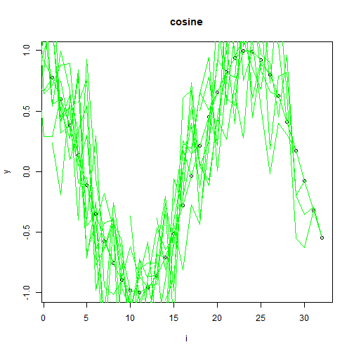

Jitter: Adds small random perturbations (e.g., Gaussian noise) to windows, encouraging the model to be invariant to minor measurement errors and sensor noise. The noise level should be small relative to the signal.

Objective: Demonstrate jitter augmentation (adding low-amplitude noise) on sliding windows to increase model robustness.


``` r
# Time series augmentation - jitter

# Installing the package (if needed)
#install.packages("tspredit")
```


``` r
# Loading the packages
library(daltoolbox)
library(tspredit) 
```


``` r
# Series for study

data(tsd)
library(ggplot2)
plot_ts(x=tsd$x, y=tsd$y) + theme(text = element_text(size=16))
```


``` r
# Sliding windows

sw_size <- 10
xw <- ts_data(tsd$y, sw_size)
```


``` r
# Augmentation (jitter)

augment <- ts_aug_jitter()
augment <- fit(augment, xw)
xa <- transform(augment, xw)
idx <- attr(xa, "idx")
ts_head(xa)
```

```
##             t9        t8        t7        t6        t5        t4        t3        t2         t1         t0
## [1,] 0.0000000 0.2474040 0.4794255 0.6816388 0.8414710 0.9489846 0.9974950 0.9839859  0.9092974  0.7780732
## [2,] 0.2474040 0.4794255 0.6816388 0.8414710 0.9489846 0.9974950 0.9839859 0.9092974  0.7780732  0.5984721
## [3,] 0.4794255 0.6816388 0.8414710 0.9489846 0.9974950 0.9839859 0.9092974 0.7780732  0.5984721  0.3816610
## [4,] 0.6816388 0.8414710 0.9489846 0.9974950 0.9839859 0.9092974 0.7780732 0.5984721  0.3816610  0.1411200
## [5,] 0.8414710 0.9489846 0.9974950 0.9839859 0.9092974 0.7780732 0.5984721 0.3816610  0.1411200 -0.1081951
## [6,] 0.9489846 0.9974950 0.9839859 0.9092974 0.7780732 0.5984721 0.3816610 0.1411200 -0.1081951 -0.3507832
```


``` r
# Plot (original vs augmented windows)

i <- 1:nrow(xw)
y <- xw[,sw_size]
plot(x = i, y = y, main = "cosine")
lines(x = i, y = y, col="black")
for (j in 1:nrow(xa)) {
  lines(x = (idx[j]-sw_size+1):idx[j], y = xa[j,1:sw_size], col="green")
}
```



References
- T. T. Um et al. (2017). Data augmentation of wearable sensor data for Parkinson’s disease monitoring using convolutional neural networks. ACM ICMI.
- H. I. Fawaz, G. Forestier, J. Weber, L. Idoumghar, and P.-A. Muller (2019). Deep learning for time series classification: A review. Data Mining and Knowledge Discovery, 33, 917–963.
