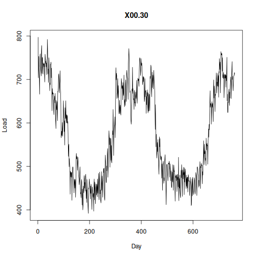

## Objective

This notebook introduces `EUNITE.Loads`, the half-hourly electrical load dataset from the EUNITE forecasting competition.

## Method at a glance

The notebook focuses on inspection. It loads the packaged object, expands it with `loadfulldata()` when necessary, and previews the structure used in later forecasting experiments.

## What you will do

- load `EUNITE.Loads`
- inspect dimensions and column names
- preview the first rows
- plot one representative half-hour interval across days


``` r
source(url("https://raw.githubusercontent.com/cefet-rj-dal/tspredit/main/examples/seed.R"))
library(tspredit)
```


``` r
expand_dataset <- function(x) {
  url <- attr(x, "url")
  if (is.null(url) || !nzchar(url)) x else loadfulldata(x)
}
```


``` r
data(EUNITE.Loads)
EUNITE.Loads <- expand_dataset(EUNITE.Loads)
cat("Dataset: EUNITE.Loads\n")
```

```
## Dataset: EUNITE.Loads
```

``` r
cat("Rows:", nrow(EUNITE.Loads), "\n")
```

```
## Rows: 761
```

``` r
cat("Columns:", ncol(EUNITE.Loads), "\n")
```

```
## Columns: 49
```

``` r
head(names(EUNITE.Loads))
```

```
## [1] "X00.30" "X01.00" "X01.30" "X02.00" "X02.30" "X03.00"
```

``` r
head(EUNITE.Loads[, 1:6])
```

```
##   X00.30 X01.00 X01.30 X02.00 X02.30 X03.00
## 1    797    794    784    787    763    749
## 2    704    697    704    676    664    668
## 3    753    720    710    705    691    698
## 4    720    704    711    708    704    670
## 5    704    674    672    677    646    649
## 6    701    704    688    664    648    649
```


``` r
ts.plot(EUNITE.Loads[[1]], ylab = "Load", xlab = "Day", main = names(EUNITE.Loads)[1])
```



## References

- Chen, B.-J., Chang, M.-W., and Lin, C.-J. (2004). Load forecasting using support vector machines: a study on EUNITE competition 2001.
