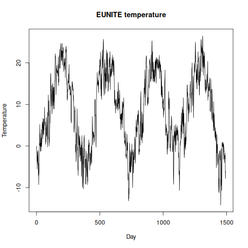

## Objective

This notebook introduces `EUNITE.Temp`, the daily temperature series used as an exogenous regressor in the EUNITE competition setting.

## Method at a glance

The notebook inspects the structure of the temperature series and plots it as a univariate regressor candidate.

## What you will do

- load `EUNITE.Temp`
- inspect dimensions and columns
- preview the first rows
- plot the temperature series


``` r
source(url("https://raw.githubusercontent.com/cefet-rj-dal/tspredit/main/examples/seed.R"))
library(tspredit)
```


``` r
expand_dataset <- function(x) {
  url <- attr(x, "url")
  if (is.null(url) || !nzchar(url)) x else loadfulldata(x)
}
```


``` r
data(EUNITE.Temp)
EUNITE.Temp <- expand_dataset(EUNITE.Temp)
cat("Dataset: EUNITE.Temp\n")
```

```
## Dataset: EUNITE.Temp
```

``` r
cat("Rows:", nrow(EUNITE.Temp), "\n")
```

```
## Rows: 1492
```

``` r
cat("Columns:", paste(names(EUNITE.Temp), collapse = ", "), "\n")
```

```
## Columns: Temperature, split
```

``` r
head(EUNITE.Temp)
```

```
##   Temperature split
## 1         0.0 train
## 2        -1.6 train
## 3        -1.9 train
## 4        -3.9 train
## 5        -2.4 train
## 6        -5.5 train
```


``` r
ts.plot(EUNITE.Temp[[1]], ylab = "Temperature", xlab = "Day", main = "EUNITE temperature")
```



## References

- Chen, B.-J., Chang, M.-W., and Lin, C.-J. (2004). Load forecasting using support vector machines: a study on EUNITE competition 2001.
