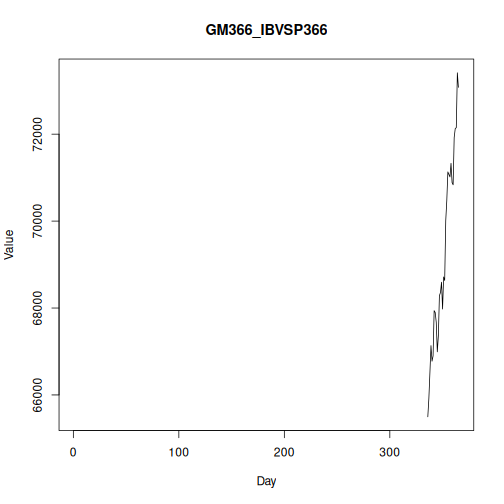

## Objective

This notebook introduces `ipeadata.d`, the daily macroeconomic dataset from Ipea.

## Method at a glance

The notebook inspects the wide table layout used to package multiple univariate daily series in one object.

## What you will do

- load `ipeadata.d`
- inspect dimensions and column names
- preview the first rows
- plot the first available series


``` r
source(url("https://raw.githubusercontent.com/cefet-rj-dal/tspredit/main/examples/seed.R"))
library(tspredit)
```


``` r
expand_dataset <- function(x) {
  url <- attr(x, "url")
  if (is.null(url) || !nzchar(url)) x else loadfulldata(x)
}
```


``` r
data(ipeadata.d)
ipeadata.d <- expand_dataset(ipeadata.d)
ipeadata.d <- tail(ipeadata.d, 365)
cat("Dataset: ipeadata.d\n")
```

```
## Dataset: ipeadata.d
```

``` r
cat("Rows:", nrow(ipeadata.d), "\n")
```

```
## Rows: 365
```

``` r
cat("Columns:", ncol(ipeadata.d), "\n")
```

```
## Columns: 13
```

``` r
head(names(ipeadata.d))
```

```
## [1] "GM366_IBVSP366"  "GM366_ERC366"    "GM366_EREURO366" "GM366_ERPV366"   "GM366_ERV366"    "GM366_TJOVER366"
```

``` r
head(ipeadata.d[, 1:4])
```

```
##      GM366_IBVSP366 GM366_ERC366 GM366_EREURO366 GM366_ERPV366
## 7820             NA       3.5865              NA          2.67
## 7821             NA       3.6575              NA          2.66
## 7822             NA       3.6743              NA          2.63
## 7823             NA       3.6915              NA          2.59
## 7824             NA       3.6379              NA          2.68
## 7825             NA       3.5278              NA          2.70
```


``` r
ts.plot(ipeadata.d[[1]], ylab = "Value", xlab = "Day", main = names(ipeadata.d)[1])
```



## References

- Ipea. Ipeadata portal.
