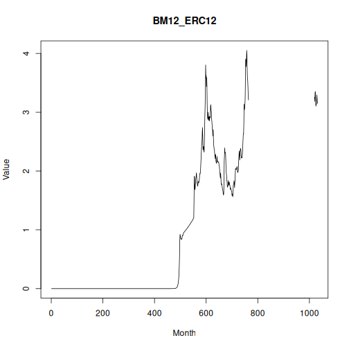

## Objective

This notebook introduces `ipeadata.m`, the monthly macroeconomic dataset from Ipea.

## Method at a glance

The focus is on the wide-table representation used to package multiple monthly univariate series.

## What you will do

- load `ipeadata.m`
- inspect dimensions and column names
- preview the first rows
- plot the first available series


``` r
source(url("https://raw.githubusercontent.com/cefet-rj-dal/tspredit/main/examples/seed.R"))
library(tspredit)
```


``` r
expand_dataset <- function(x) {
  url <- attr(x, "url")
  if (is.null(url) || !nzchar(url)) x else loadfulldata(x)
}
```


``` r
data(ipeadata.m)
ipeadata.m <- expand_dataset(ipeadata.m)
cat("Dataset: ipeadata.m\n")
```

```
## Dataset: ipeadata.m
```

``` r
cat("Rows:", nrow(ipeadata.m), "\n")
```

```
## Rows: 1031
```

``` r
cat("Columns:", ncol(ipeadata.m), "\n")
```

```
## Columns: 24
```

``` r
head(names(ipeadata.m))
```

```
## [1] "BM12_ERC12"      "BM12_ERV12"      "IGP12_IGPDI12"   "FUNCEX12_MDPT12" "FUNCEX12_XPT12"  "PRECOS12_INPC12"
```

``` r
head(ipeadata.m[, 1:4])
```

```
##    BM12_ERC12  BM12_ERV12 IGP12_IGPDI12 FUNCEX12_MDPT12
## 1 6.68364e-15 3.27273e-15   8.37138e-14           59.42
## 2 1.33783e-14 3.27273e-15   8.49270e-14           59.50
## 3 1.33783e-14 3.16364e-15   8.61402e-14           60.01
## 4 1.48836e-14 3.09091e-15   8.73535e-14           60.01
## 5 1.42757e-14 3.09091e-15   8.85667e-14           61.12
## 6 1.56703e-14 3.20000e-15   8.97800e-14           66.66
```


``` r
ts.plot(ipeadata.m[[1]], ylab = "Value", xlab = "Month", main = names(ipeadata.m)[1])
```



## References

- Ipea. Ipeadata portal.
