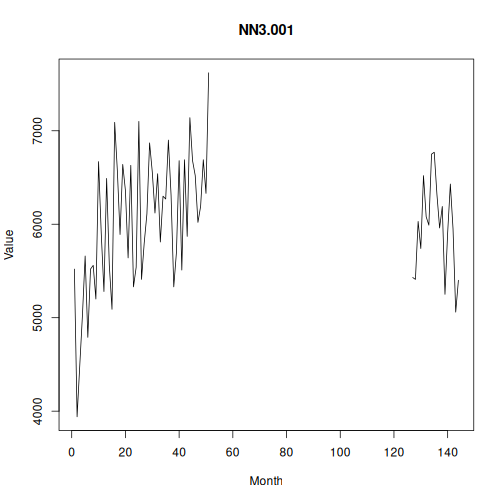

## Objective

This notebook introduces `NN3`, the monthly forecasting competition archive.

## Method at a glance

The notebook inspects the wide data-frame representation, where each column corresponds to one series in the archive.

## What you will do

- load `NN3`
- inspect dimensions and column names
- preview the first rows
- plot one representative series


``` r
source(url("https://raw.githubusercontent.com/cefet-rj-dal/tspredit/main/examples/seed.R"))
library(tspredit)
```


``` r
expand_dataset <- function(x) {
  url <- attr(x, "url")
  if (is.null(url) || !nzchar(url)) x else loadfulldata(x)
}
```


``` r
data(NN3)
NN3 <- expand_dataset(NN3)
cat("Dataset: NN3\n")
```

```
## Dataset: NN3
```

``` r
cat("Rows:", nrow(NN3), "\n")
```

```
## Rows: 144
```

``` r
cat("Columns:", ncol(NN3), "\n")
```

```
## Columns: 112
```

``` r
head(names(NN3))
```

```
## [1] "NN3.001" "NN3.002" "NN3.003" "NN3.004" "NN3.005" "NN3.006"
```

``` r
head(NN3[, 1:4])
```

```
##   NN3.001 NN3.002 NN3.003 NN3.004
## 1    5520    5080    6320    5500
## 2    3940    3690    4770    3860
## 3    4490    4260    5740    4880
## 4    5030    3920    5360    4420
## 5    5660    4290    4990    4900
## 6    4790    3840    5330    4230
```


``` r
ts.plot(NN3[[1]], ylab = "Value", xlab = "Month", main = names(NN3)[1])
```



## References

- Crone, S. F., Hibon, M., and Nikolopoulos, K. (2011). Advances in forecasting with neural networks? Empirical evidence from the NN3 competition on time series prediction.
