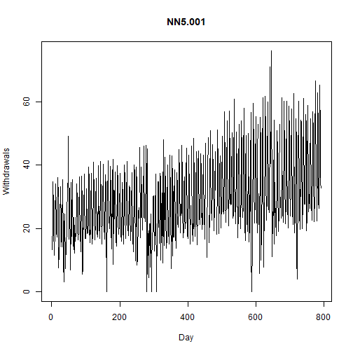

## Objective

This notebook introduces `NN5`, the daily forecasting competition archive based on ATM withdrawals.

## Method at a glance

The notebook inspects the wide data-frame layout and previews one representative series.

## What you will do

- load `NN5`
- inspect dimensions and column names
- preview the first rows
- plot one representative series


``` r
source(url("https://raw.githubusercontent.com/cefet-rj-dal/tspredit/main/examples/seed.R"))
library(tspredit)
```


``` r
expand_dataset <- function(x) {
  url <- attr(x, "url")
  if (is.null(url) || !nzchar(url)) x else loadfulldata(x)
}
```


``` r
data(NN5)
NN5 <- expand_dataset(NN5)
NN5 <- tail(NN5, 1000)
cat("Dataset: NN5\n")
```

```
## Dataset: NN5
```

``` r
cat("Rows:", nrow(NN5), "\n")
```

```
## Rows: 791
```

``` r
cat("Columns:", ncol(NN5), "\n")
```

```
## Columns: 112
```

``` r
head(names(NN5))
```

```
## [1] "NN5.001" "NN5.002" "NN5.003" "NN5.004" "NN5.005" "NN5.006"
```

``` r
head(NN5[, 1:4])
```

```
##    NN5.001  NN5.002  NN5.003   NN5.004
## 1 13.40703 11.55045  5.64059 13.180272
## 2 14.72506 13.59127 14.39909  8.446712
## 3 20.56406 15.03685 24.41893 19.515306
## 4 34.70805 21.57029 28.78401 28.883220
## 5 26.62982 19.44444 20.62075 19.472789
## 6 16.60998  0.00000 13.80385  0.000000
```


``` r
ts.plot(NN5[[1]], ylab = "Withdrawals", xlab = "Day", main = names(NN5)[1])
```



## References

- Crone, S. F. (2008). Results of the NN5 Time Series Forecasting Competition.
