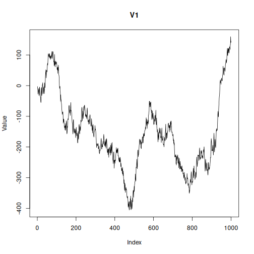

## Objective

This notebook introduces `CATS`, the artificial time-series benchmark with missing blocks.

## Method at a glance

The notebook inspects the data-frame structure used to package the known segments of the benchmark.

## What you will do

- load `CATS`
- inspect dimensions and columns
- preview the first rows
- plot the first available segment


``` r
source(url("https://raw.githubusercontent.com/cefet-rj-dal/tspredit/main/examples/seed.R"))
library(tspredit)
```


``` r
expand_dataset <- function(x) {
  url <- attr(x, "url")
  if (is.null(url) || !nzchar(url)) x else loadfulldata(x)
}
```


``` r
data(CATS)
CATS <- expand_dataset(CATS)
cat("Dataset: CATS\n")
```

```
## Dataset: CATS
```

``` r
cat("Rows:", nrow(CATS), "\n")
```

```
## Rows: 1000
```

``` r
cat("Columns:", ncol(CATS), "\n")
```

```
## Columns: 6
```

``` r
head(CATS)
```

```
##       V1     V2     V3    V4     V5 split
## 1  -2.85 150.21 328.40  2.00 290.28 train
## 2 -13.07 136.41 311.23  5.11 298.11 train
## 3 -17.81 126.87 312.86  5.40 286.62 train
## 4 -27.81 128.68 302.26 28.68 289.06 train
## 5 -20.51 124.60 293.69 21.65 277.59 train
## 6 -15.29 108.15 316.35 31.61 305.87 train
```


``` r
ts.plot(CATS[[1]], ylab = "Value", xlab = "Index", main = names(CATS)[1])
```



## References

- Lendasse, A. et al. (2004, 2007). The CATS benchmark.
