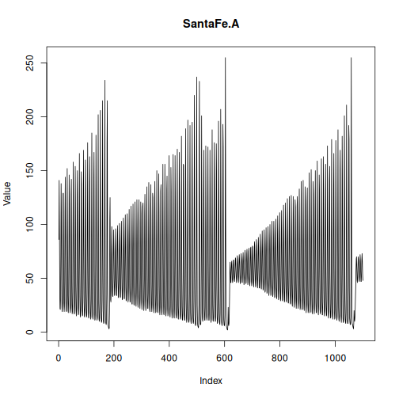

## Objective

This notebook introduces `SantaFe.A`, the nonlinear laser series from the Santa Fe competition.

## Method at a glance

The notebook inspects the single-series structure and plots the full available signal.

## What you will do

- load `SantaFe.A`
- inspect dimensions and columns
- preview the first rows
- plot the series


``` r
source(url("https://raw.githubusercontent.com/cefet-rj-dal/tspredit/main/examples/seed.R"))
library(tspredit)
```


``` r
expand_dataset <- function(x) {
  url <- attr(x, "url")
  if (is.null(url) || !nzchar(url)) x else loadfulldata(x)
}
```


``` r
data(SantaFe.A)
SantaFe.A <- expand_dataset(SantaFe.A)
cat("Dataset: SantaFe.A\n")
```

```
## Dataset: SantaFe.A
```

``` r
cat("Rows:", nrow(SantaFe.A), "\n")
```

```
## Rows: 1100
```

``` r
cat("Columns:", paste(names(SantaFe.A), collapse = ", "), "\n")
```

```
## Columns: V1, split
```

``` r
head(SantaFe.A)
```

```
##    V1 split
## 1  86 train
## 2 141 train
## 3  95 train
## 4  41 train
## 5  22 train
## 6  21 train
```


``` r
ts.plot(SantaFe.A[[1]], ylab = "Value", xlab = "Index", main = "SantaFe.A")
```



## References

- Weigend, A. S. (1993). Time Series Prediction: Forecasting the Future and Understanding the Past.
