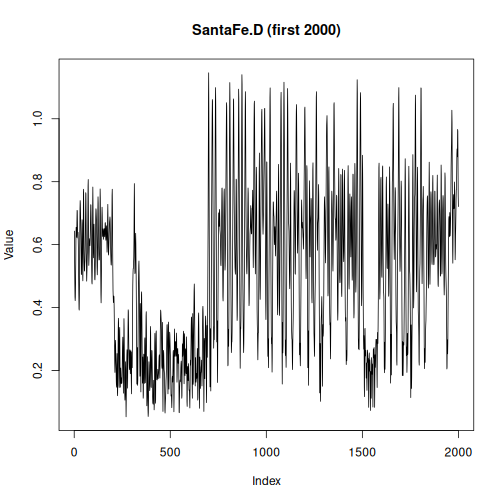

## Objective

This notebook introduces `SantaFe.D`, the long simulated nonlinear series from the Santa Fe competition.

## Method at a glance

The notebook inspects the single-series structure and plots a manageable preview of the first observations.

## What you will do

- load `SantaFe.D`
- inspect dimensions and columns
- preview the first rows
- plot a subset of the series


``` r
source(url("https://raw.githubusercontent.com/cefet-rj-dal/tspredit/main/examples/seed.R"))
library(tspredit)
```


``` r
expand_dataset <- function(x) {
  url <- attr(x, "url")
  if (is.null(url) || !nzchar(url)) x else loadfulldata(x)
}
```


``` r
data(SantaFe.D)
SantaFe.D <- expand_dataset(SantaFe.D)
cat("Dataset: SantaFe.D\n")
```

```
## Dataset: SantaFe.D
```

``` r
cat("Rows:", nrow(SantaFe.D), "\n")
```

```
## Rows: 100500
```

``` r
cat("Columns:", paste(names(SantaFe.D), collapse = ", "), "\n")
```

```
## Columns: V1, split
```

``` r
head(SantaFe.D)
```

```
##      V1 split
## 1 0.643 train
## 2 0.558 train
## 3 0.484 train
## 4 0.434 train
## 5 0.422 train
## 6 0.433 train
```


``` r
ts.plot(SantaFe.D[[1]][1:2000], ylab = "Value", xlab = "Index", main = "SantaFe.D (first 2000)")
```



## References

- Weigend, A. S. (1993). Time Series Prediction: Forecasting the Future and Understanding the Past.
