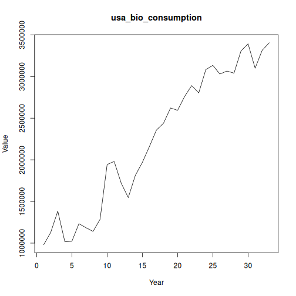

## Objective

This notebook introduces `bioenergy`, the FAOSTAT bioenergy collection.

## Method at a glance

The notebook inspects the list-based structure and previews one annual series from the collection.

## What you will do

- load `bioenergy`
- inspect the number of available series
- preview the first keys
- plot one representative series


``` r
source(url("https://raw.githubusercontent.com/cefet-rj-dal/tspredit/main/examples/seed.R"))
library(tspredit)
```


``` r
expand_dataset <- function(x) {
  url <- attr(x, "url")
  if (is.null(url) || !nzchar(url)) x else loadfulldata(x)
}
```


``` r
data(bioenergy)
bioenergy <- expand_dataset(bioenergy)
cat("Dataset: bioenergy\n")
```

```
## Dataset: bioenergy
```

``` r
cat("Series available:", length(bioenergy), "\n")
```

```
## Series available: 20
```

``` r
head(names(bioenergy))
```

```
## [1] "usa_bio_consumption"     "usa_bio_production"      "china_bio_consumption"   "china_bio_production"   
## [5] "germany_bio_consumption" "germany_bio_production"
```

``` r
head(bioenergy[[1]])
```

```
##    1990    1991    1992    1993    1994    1995 
##  980185 1130112 1384457 1016991 1022212 1233701
```


``` r
ts.plot(bioenergy[[1]], ylab = "Value", xlab = "Year", main = names(bioenergy)[1])
```



## References

- FAOSTAT Bioenergy Database.
