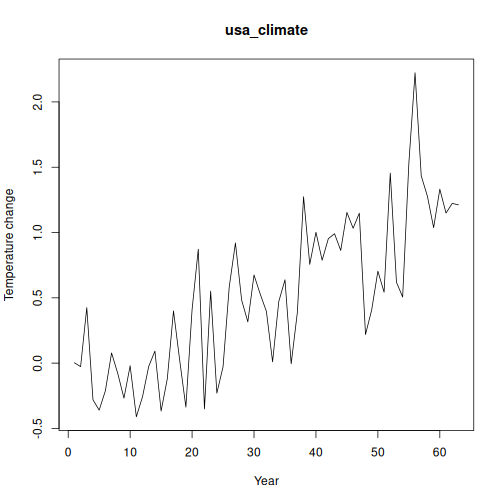

## Objective

This notebook introduces `climate`, the FAOSTAT/NASA-GISS land temperature change collection.

## Method at a glance

The notebook inspects the list-based structure and previews one annual series.

## What you will do

- load `climate`
- inspect the number of available series
- preview the first keys
- plot one representative series


``` r
source(url("https://raw.githubusercontent.com/cefet-rj-dal/tspredit/main/examples/seed.R"))
library(tspredit)
```


``` r
expand_dataset <- function(x) {
  url <- attr(x, "url")
  if (is.null(url) || !nzchar(url)) x else loadfulldata(x)
}
```


``` r
data(climate)
climate <- expand_dataset(climate)
cat("Dataset: climate\n")
```

```
## Dataset: climate
```

``` r
cat("Series available:", length(climate), "\n")
```

```
## Series available: 10
```

``` r
head(names(climate))
```

```
## [1] "usa_climate"     "china_climate"   "germany_climate" "japan_climate"   "india_climate"   "uk_climate"
```

``` r
head(climate[[1]])
```

```
##   1961   1962   1963   1964   1965   1966 
##  0.003 -0.027  0.425 -0.281 -0.360 -0.212
```


``` r
ts.plot(climate[[1]], ylab = "Temperature change", xlab = "Year", main = names(climate)[1])
```



## References

- FAOSTAT Land, Inputs and Sustainability.
