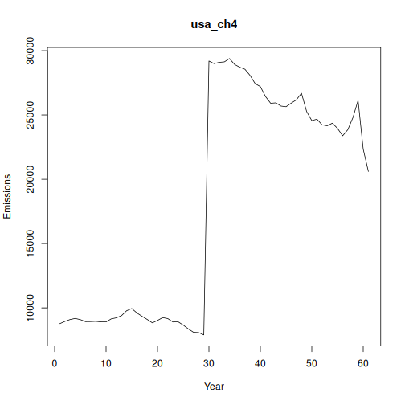

## Objective

This notebook introduces `emissions`, the greenhouse-gas emissions collection distributed with `tspredit`.

## Method at a glance

The notebook inspects the list-based structure and previews one annual series from the collection.

## What you will do

- load `emissions`
- inspect the number of available series
- preview the first keys
- plot one representative series


``` r
source(url("https://raw.githubusercontent.com/cefet-rj-dal/tspredit/main/examples/seed.R"))
library(tspredit)
```


``` r
expand_dataset <- function(x) {
  url <- attr(x, "url")
  if (is.null(url) || !nzchar(url)) x else loadfulldata(x)
}
```


``` r
data(emissions)
emissions <- expand_dataset(emissions)
cat("Dataset: emissions\n")
```

```
## Dataset: emissions
```

``` r
cat("Series available:", length(emissions), "\n")
```

```
## Series available: 20
```

``` r
head(names(emissions))
```

```
## [1] "usa_ch4"     "usa_n2o"     "china_ch4"   "china_n2o"   "germany_ch4" "germany_n2o"
```

``` r
head(emissions[[1]])
```

```
##     1961     1962     1963     1964     1965     1966 
## 8771.699 8946.694 9093.237 9177.366 9084.893 8929.103
```


``` r
ts.plot(emissions[[1]], ylab = "Emissions", xlab = "Year", main = names(emissions)[1])
```



## References

- FAOSTAT Emissions Totals.
