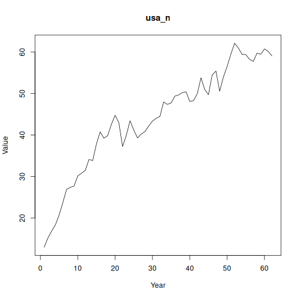

## Objective

This notebook introduces `fertilizers`, the FAOSTAT fertilizers-by-nutrient collection.

## Method at a glance

The notebook inspects the list-based structure and previews one annual series from the collection.

## What you will do

- load `fertilizers`
- inspect the number of available series
- preview the first keys
- plot one representative series


``` r
source(url("https://raw.githubusercontent.com/cefet-rj-dal/tspredit/main/examples/seed.R"))
library(tspredit)
```


``` r
expand_dataset <- function(x) {
  url <- attr(x, "url")
  if (is.null(url) || !nzchar(url)) x else loadfulldata(x)
}
```


``` r
data(fertilizers)
fertilizers <- expand_dataset(fertilizers)
cat("Dataset: fertilizers\n")
```

```
## Dataset: fertilizers
```

``` r
cat("Series available:", length(fertilizers), "\n")
```

```
## Series available: 30
```

``` r
head(names(fertilizers))
```

```
## [1] "usa_n"      "usa_p2o5"   "usa_k2o"    "china_n"    "china_p2o5" "china_k2o"
```

``` r
head(fertilizers[[1]])
```

```
##  1961  1962  1963  1964  1965  1966 
## 12.96 15.18 16.85 18.34 20.69 23.69
```


``` r
ts.plot(fertilizers[[1]], ylab = "Value", xlab = "Year", main = names(fertilizers)[1])
```



## References

- FAOSTAT Fertilizers by Nutrient.
