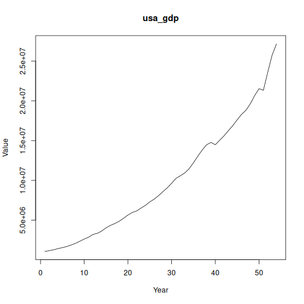

## Objective

This notebook introduces `gdp`, the GDP and agriculture value-added collection.

## Method at a glance

The notebook inspects the list-based structure and previews one annual series from the collection.

## What you will do

- load `gdp`
- inspect the number of available series
- preview the first keys
- plot one representative series


``` r
source(url("https://raw.githubusercontent.com/cefet-rj-dal/tspredit/main/examples/seed.R"))
library(tspredit)
```


``` r
expand_dataset <- function(x) {
  url <- attr(x, "url")
  if (is.null(url) || !nzchar(url)) x else loadfulldata(x)
}
```


``` r
data(gdp)
gdp <- expand_dataset(gdp)
cat("Dataset: gdp\n")
```

```
## Dataset: gdp
```

``` r
cat("Series available:", length(gdp), "\n")
```

```
## Series available: 10
```

``` r
head(names(gdp))
```

```
## [1] "usa_gdp"     "china_gdp"   "germany_gdp" "japan_gdp"   "india_gdp"   "uk_gdp"
```

``` r
head(gdp[[1]])
```

```
##    1970    1971    1972    1973    1974    1975 
## 1073303 1164850 1279110 1425376 1545243 1684904
```


``` r
ts.plot(gdp[[1]], ylab = "Value", xlab = "Year", main = names(gdp)[1])
```



## References

- FAOSTAT Macro Indicators Database.
