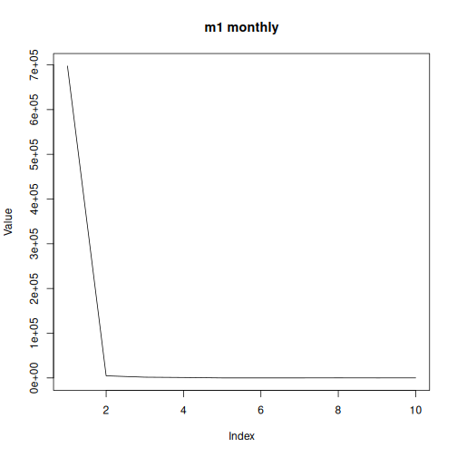

## Objective

This notebook introduces `m1`, the first Makridakis competition archive.

## Method at a glance

The notebook inspects the nested-list structure keyed by frequency and previews one representative series.

## What you will do

- load `m1`
- inspect the available frequency groups
- preview one representative series
- plot a sample series


``` r
source(url("https://raw.githubusercontent.com/cefet-rj-dal/tspredit/main/examples/seed.R"))
library(tspredit)
```


``` r
expand_dataset <- function(x) {
  url <- attr(x, "url")
  if (is.null(url) || !nzchar(url)) x else loadfulldata(x)
}
```


``` r
data(m1)
m1 <- expand_dataset(m1)
cat("Dataset: m1\n")
```

```
## Dataset: m1
```

``` r
cat("Frequency groups:", paste(names(m1), collapse = ", "), "\n")
```

```
## Frequency groups: monthly, quarterly, yearly
```

``` r
first_group <- names(m1)[1]
first_series <- m1[[first_group]][[1]]
head(first_series)
```

```
## [1] 697458.00   4742.66   1656.32    987.63      0.52     15.25
```


``` r
ts.plot(first_series, ylab = "Value", xlab = "Index", main = paste("m1", first_group))
```



## References

- Makridakis et al. (1982). The accuracy of extrapolation methods: Results of a forecasting competition.
