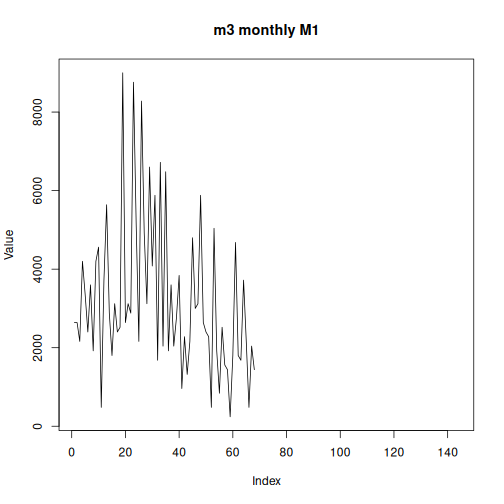

## Objective

This notebook introduces `m3`, the third Makridakis competition archive.

## Method at a glance

The notebook inspects the nested-list structure keyed by frequency and previews one representative series.

## What you will do

- load `m3`
- inspect the available frequency groups
- preview one representative series
- plot a sample series


``` r
source(url("https://raw.githubusercontent.com/cefet-rj-dal/tspredit/main/examples/seed.R"))
library(tspredit)
```


``` r
expand_dataset <- function(x) {
  url <- attr(x, "url")
  if (is.null(url) || !nzchar(url)) x else loadfulldata(x)
}
```


``` r
data(m3)
m3 <- expand_dataset(m3)
cat("Dataset: m3\n")
```

```
## Dataset: m3
```

``` r
cat("Frequency groups:", paste(names(m3), collapse = ", "), "\n")
```

```
## Frequency groups: monthly, other, quarterly, yearly
```

``` r
first_group <- names(m3)[1]
first_name <- names(m3[[first_group]])[1]
first_series <- m3[[first_group]][[first_name]]
head(first_series)
```

```
## [1] 2640 2640 2160 4200 3360 2400
```


``` r
ts.plot(first_series, ylab = "Value", xlab = "Index", main = paste("m3", first_group, first_name))
```



## References

- Makridakis and Hibon (2000). The M3-Competition: Results, conclusions and implications.
