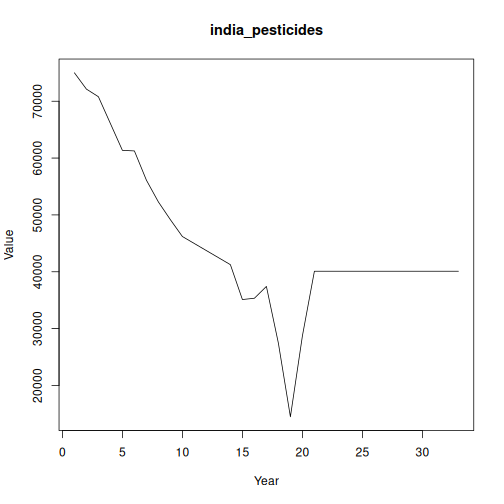

## Objective

This notebook introduces `pesticides`, the FAOSTAT pesticides-use collection.

## Method at a glance

The notebook inspects the list-based structure and previews one annual series from the collection.

## What you will do

- load `pesticides`
- inspect the number of available series
- preview the first keys
- plot one representative series


``` r
source(url("https://raw.githubusercontent.com/cefet-rj-dal/tspredit/main/examples/seed.R"))
library(tspredit)
```


``` r
expand_dataset <- function(x) {
  url <- attr(x, "url")
  if (is.null(url) || !nzchar(url)) x else loadfulldata(x)
}
```


``` r
data(pesticides)
pesticides <- expand_dataset(pesticides)
cat("Dataset: pesticides\n")
```

```
## Dataset: pesticides
```

``` r
cat("Series available:", length(pesticides), "\n")
```

```
## Series available: 10
```

``` r
head(names(pesticides))
```

```
## [1] "india_pesticides"   "japan_pesticides"   "canada_pesticides"  "usa_pesticides"     "china_pesticides"  
## [6] "germany_pesticides"
```

``` r
head(pesticides[[1]])
```

```
##  1990  1991  1992  1993  1994  1995 
## 75000 72133 70791 66074 61357 61257
```


``` r
ts.plot(pesticides[[1]], ylab = "Value", xlab = "Year", main = names(pesticides)[1])
```



## References

- FAOSTAT Pesticides Use Database.
