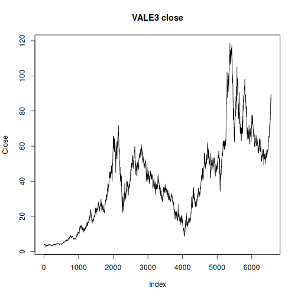

## Objective

This notebook introduces `stocks`, the packaged B3 stock-market collection.

## Method at a glance

The notebook inspects the list-of-data-frames structure and previews one ticker entry with its OHLCV fields.

## What you will do

- load `stocks`
- inspect the available tickers
- preview the structure of the first ticker
- plot the closing-price series


``` r
source(url("https://raw.githubusercontent.com/cefet-rj-dal/tspredit/main/examples/seed.R"))
library(tspredit)
```


``` r
expand_dataset <- function(x) {
  url <- attr(x, "url")
  if (is.null(url) || !nzchar(url)) x else loadfulldata(x)
}
```


``` r
data(stocks)
stocks <- expand_dataset(stocks)
cat("Dataset: stocks\n")
```

```
## Dataset: stocks
```

``` r
cat("Tickers available:", length(stocks), "\n")
```

```
## Tickers available: 41
```

``` r
head(names(stocks))
```

```
## [1] "VALE3" "ITUB4" "PETR4" "PETR3" "BBDC4" "SBSP3"
```

``` r
first_ticker <- names(stocks)[1]
first_series <- stocks[[first_ticker]]
head(first_series)
```

```
##         date     open     high      low    close  volume
## 1 2000-01-03 3.500000 3.542500 3.500000 3.500000  585600
## 2 2000-01-04 3.466666 3.474166 3.416666 3.416666  782400
## 3 2000-01-05 3.375000 3.416666 3.375000 3.416666 1876800
## 4 2000-01-06 3.416666 3.500000 3.416666 3.416666  792000
## 5 2000-01-07 3.458333 3.559166 3.458333 3.541666 5347200
## 6 2000-01-10 3.750000 3.833333 3.750000 3.833333 2980800
```


``` r
ts.plot(first_series$close, ylab = "Close", xlab = "Index", main = paste(first_ticker, "close"))
```



## References

- B3 historical trading data.
