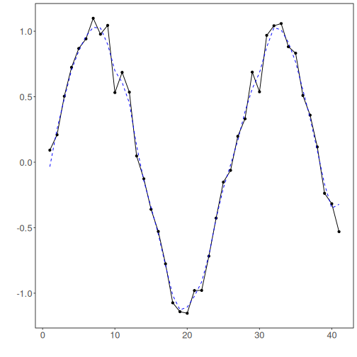

## Wavelet Filter

About the method
- Wavelet denoising decomposes the series across multiple scales and removes detail components associated with noise.
- It is appropriate when the series contains local patterns at different resolutions.

Didactic goal: understand a multiscale filtering strategy and compare it with FFT-based smoothing.


``` r
source(url("https://raw.githubusercontent.com/cefet-rj-dal/tspredit/main/examples/seed.R"))
# Filter - Wavelets

# Installing the package (if needed)
#install.packages("tspredit")
```

We start by loading the packages used throughout this example.


``` r
# Loading the packages
library(daltoolbox)
library(tspredit) 
```


We load the example series that will be used throughout the demonstration.


``` r
# Series for study with artificial noise and spikes

data(tsd)
y <- tsd$y
noise <- rnorm(length(y), 0, sd(y)/10)
spike <- rnorm(1, 0, sd(y))
tsd$y <- tsd$y + noise
tsd$y[10] <- tsd$y[10] + spike
tsd$y[20] <- tsd$y[20] + spike
tsd$y[30] <- tsd$y[30] + spike
```

We plot the data here so the effect of the next transformation can be compared visually.


``` r
library(ggplot2)
# Noisy series visualization
plot_ts(x=tsd$x, y=tsd$y) + theme(text = element_text(size=16))
```


Now we applying the wavelet filter.


``` r
# Applying the Wavelet filter

filter <- ts_fil_wavelet()
set_example_seed()
filter <- fit(filter, tsd$y)
y <- transform(filter, tsd$y)
plot_ts_pred(y=tsd$y, yadj=y) + theme(text = element_text(size=16))
```



References
- D. L. Donoho and I. M. Johnstone (1994). Ideal spatial adaptation by wavelet shrinkage. Biometrika, 81(3), 425–455.

