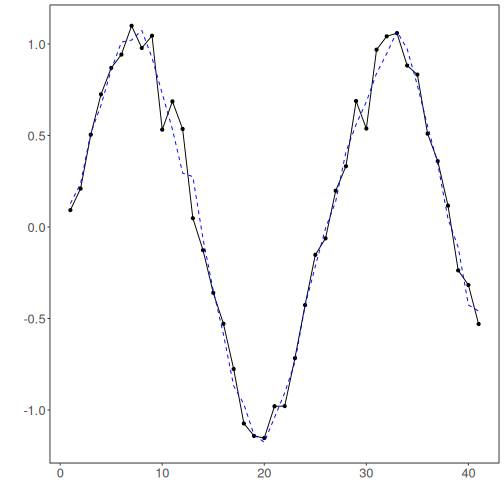

## EMD Filter

About the method
- Empirical Mode Decomposition (EMD) breaks the series into intrinsic mode functions extracted directly from the data.
- By reconstructing the signal from selected components, you can suppress high-frequency noise while preserving meaningful structure.

Didactic goal: see an adaptive decomposition method that does not assume a fixed basis in advance.


``` r
source(url("https://raw.githubusercontent.com/cefet-rj-dal/tspredit/main/examples/seed.R"))
# Filter - EMD

# Install tspredit if needed
#install.packages("tspredit")
```

We load the packages required by this example.


``` r
# Load packages
library(daltoolbox)
library(tspredit) 
```


This chunk prepare a noisy series example.


``` r
# Prepare a noisy series example
data(tsd)
y <- tsd$y
noise <- rnorm(length(y), 0, sd(y)/10)
spike <- rnorm(1, 0, sd(y))
tsd$y <- tsd$y + noise
tsd$y[10] <- tsd$y[10] + spike
tsd$y[20] <- tsd$y[20] + spike
tsd$y[30] <- tsd$y[30] + spike
```

We plot the data here so the effect of the next transformation can be compared visually.


``` r
library(ggplot2)
# Visualize the noisy input
plot_ts(x=tsd$x, y=tsd$y) + theme(text = element_text(size=16))
```


We now apply emd-based filtering (imf reconstruction) so its effect on the series can be inspected directly.


``` r
# Apply EMD-based filtering (IMF reconstruction)

filter <- ts_fil_emd()          # decompose into IMFs
set_example_seed()
filter <- fit(filter, tsd$y)    # compute decomposition
y <- transform(filter, tsd$y)   # reconstruct a denoised version

# Compare original vs reconstructed
plot_ts_pred(y=tsd$y, yadj=y) + theme(text = element_text(size=16))
```



References
- N. E. Huang et al. (1998). The empirical mode decomposition and the Hilbert spectrum for nonlinear and non-stationary time series analysis. Proceedings of the Royal Society A, 454(1971), 903–995.

