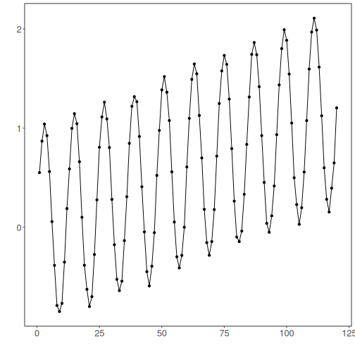
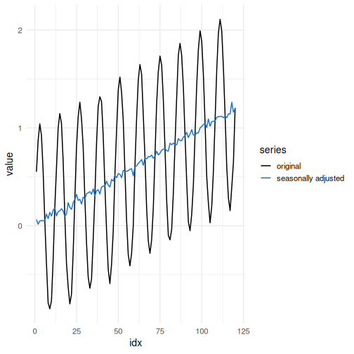

Seasonal adjustment filter: Seasonal adjustment estimates and removes recurring seasonal effects to produce a seasonally adjusted series. Common approaches include STL (Seasonal-Trend decomposition using Loess) and X‑13ARIMA‑SEATS. This example applies an STL‑based adjustment.

Objectives: Seasonal adjustment aims to remove periodic seasonal components from a series, making the underlying trend and cycle easier to analyze. After adjustment, remaining variation should reflect non-seasonal dynamics.

Notes:
- Ensure the frequency/periodicity in your data is appropriate for seasonal estimation.
- Seasonal adjustment methods can differ in how they model trend and irregular components.


``` r
source(url("https://raw.githubusercontent.com/cefet-rj-dal/tspredit/main/examples/seed.R"))
# Filter - seasonal adjustment

# Install tspredit if needed
#install.packages("tspredit")
```

We load the packages required by this example.


``` r
# Load packages
library(daltoolbox)
library(tspredit) 
```


We now build a synthetic seasonal series with a known yearly-like period. This gives the adjustment method a setting where removing seasonality is actually meaningful.


``` r
# Prepare a synthetic seasonal series with known frequency
set_example_seed()
x <- seq_len(120)
trend <- x / 100
seasonal <- sin(2 * pi * x / 12)
noise <- rnorm(length(x), 0, 0.03)
y <- trend + seasonal + noise
```

We plot the data here so the effect of the next transformation can be compared visually.


``` r
library(ggplot2)
# Visualize original seasonal series
plot_ts(x = x, y = y) + theme(text = element_text(size=16))
```



We now apply seasonal adjustment so its effect on the series can be inspected directly.


``` r
# Apply seasonal adjustment

filter <- ts_fil_seas_adj(frequency = 12)
set_example_seed()
filter <- fit(filter, y)
yhat <- transform(filter, y)

comparison <- rbind(
  data.frame(idx = x, value = y, series = "original"),
  data.frame(idx = x, value = yhat, series = "seasonally adjusted")
)

ggplot(comparison, aes(x = idx, y = value, color = series)) +
  geom_line(linewidth = 0.7) +
  scale_color_manual(values = c("original" = "black", "seasonally adjusted" = "dodgerblue3")) +
  theme_minimal(base_size = 14)
```



References
- R. B. Cleveland, W. S. Cleveland, J. E. McRae, and I. Terpenning (1990). STL: A seasonal-trend decomposition procedure based on loess. Journal of Official Statistics, 6(1), 3–73.
