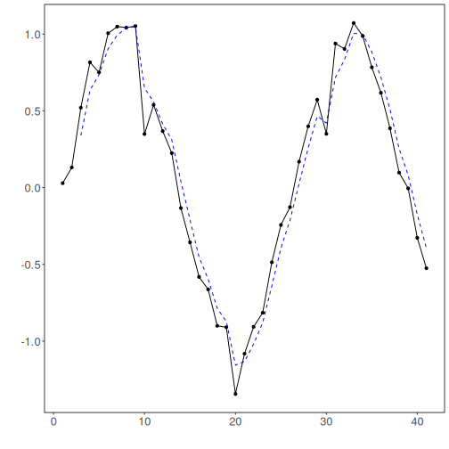

Objective: Apply Exponential Moving Average (EMA) to smooth the series, reducing fast fluctuations while keeping the trend.


``` r
# Filter - Exponential Moving Average (EMA)

# Installing the package (if needed)
#install.packages("tspredit")
```


``` r
# Loading the packages
library(daltoolbox)
library(tspredit) 
```


``` r
# Series for study with artificial noise and spikes

data(tsd)
y <- tsd$y
noise <- rnorm(length(y), 0, sd(y)/10)
spike <- rnorm(1, 0, sd(y))
tsd$y <- tsd$y + noise
tsd$y[10] <- tsd$y[10] + spike
tsd$y[20] <- tsd$y[20] + spike
tsd$y[30] <- tsd$y[30] + spike
```


``` r
library(ggplot2)
# Noisy series visualization
plot_ts(x=tsd$x, y=tsd$y) + theme(text = element_text(size=16))
```


``` r
# Applying the EMA filter

filter <- ts_fil_ema(3)
filter <- fit(filter, tsd$y)
y <- transform(filter, tsd$y)
plot_ts_pred(y=tsd$y, yadj=y) + theme(text = element_text(size=16))
```

```
## Warning: Removed 2 rows containing missing values or values outside the scale range (`geom_line()`).
```



