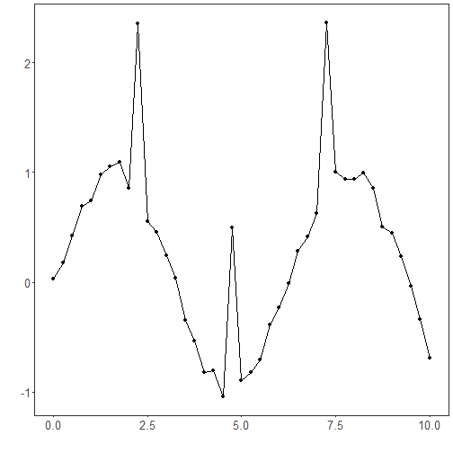
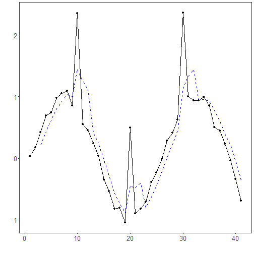

Moving Average filter: The Moving Average (MA) filter smooths short-term fluctuations by replacing each point with the average of its neighbors. It is a simple and fast baseline to reduce random noise and highlight the underlying trend.

Method
A centered or trailing window of fixed width is slid across the series; each output value is the arithmetic mean of the values inside the window. As the window size grows, variance decreases but bias (lag and peak attenuation) increases. The MA filter corresponds to a finite impulse response (FIR) low‑pass filter in the time domain.

When to use
- As a first pass to denoise a mildly noisy series
- When you want an inexpensive baseline smoother before more complex models

Key parameter
- `window`: the number of points averaged (here controlled by the first argument of `ts_fil_ma`). Larger values yield smoother curves but can lag and oversmooth peaks.


``` r
# Filter - Moving Average

# Install tspredit if needed
#install.packages("tspredit")
```


``` r
# Load packages
library(daltoolbox)
library(tspredit) 
```


``` r
# Prepare a noisy series example
# - start from built-in sample data
# - add low-amplitude Gaussian noise
# - inject a few spikes to stress-test robustness

data(tsd)
y <- tsd$y
noise <- rnorm(length(y), 0, sd(y)/10)
spike <- rnorm(1, 0, sd(y))
tsd$y <- tsd$y + noise
tsd$y[10] <- tsd$y[10] + spike
tsd$y[20] <- tsd$y[20] + spike
tsd$y[30] <- tsd$y[30] + spike
```


``` r
library(ggplot2)
# Visualize the noisy series
plot_ts(x=tsd$x, y=tsd$y) + theme(text = element_text(size=16))
```




``` r
# Apply the Moving Average filter

filter <- ts_fil_ma(3)            # window size = 3 (use larger to smooth more)
filter <- fit(filter, tsd$y)      # calibrate (no learning; keeps interface consistent)
y <- transform(filter, tsd$y)     # get smoothed series

# Compare original vs smoothed
plot_ts_pred(y=tsd$y, yadj=y) + theme(text = element_text(size=16))
```

```
## Warning: Removed 2 rows containing missing values or values outside the scale range (`geom_line()`).
```



References
- A. V. Oppenheim and R. W. Schafer (2010). Discrete-Time Signal Processing. Prentice Hall.
