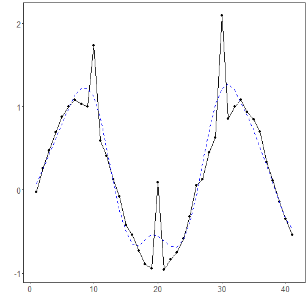

REMD filter: REMD adopts robustness enhancements to EMD, such as noise‑assisted ensemble strategies (e.g., EEMD/CEEMDAN), to stabilize the decomposition under noise and reduce mode mixing. After decomposition, high‑frequency IMFs are attenuated and the remaining components are summed to form the denoised signal.

When to use:
- Nonlinear/nonstationary series where frequency content changes over time
- You want a data-driven decomposition without fixed bases (e.g., unlike wavelets/Fourier)

Objectives: Robust Empirical Mode Decomposition (REMD) decomposes a signal into intrinsic mode functions (IMFs) in a way that is less sensitive to noise and outliers than standard EMD. Reconstructing the series from selected IMFs yields a denoised version while preserving nonstationary and nonlinear characteristics.


``` r
# Filter - REMD

# Install tspredit if needed
#install.packages("tspredit")
```


``` r
# Load packages
library(daltoolbox)
library(tspredit) 
```


``` r
# Prepare a noisy series with spikes
data(tsd)
y <- tsd$y
noise <- rnorm(length(y), 0, sd(y)/10)
spike <- rnorm(1, 0, sd(y))
tsd$y <- tsd$y + noise
tsd$y[10] <- tsd$y[10] + spike
tsd$y[20] <- tsd$y[20] + spike
tsd$y[30] <- tsd$y[30] + spike
```


``` r
library(ggplot2)
# Visualize the noisy input
plot_ts(x=tsd$x, y=tsd$y) + theme(text = element_text(size=16))
```


``` r
# Apply REMD (robust EMD)

filter <- ts_fil_remd()         # data-driven decomposition into IMFs (robust)
filter <- fit(filter, tsd$y)
y <- transform(filter, tsd$y)   # reconstruction after robust decomposition

# Compare original vs denoised
plot_ts_pred(y=tsd$y, yadj=y) + theme(text = element_text(size=16))
```



References
- Souza, J., et al. REMD: A Novel Hybrid Anomaly Detection Method Based on EMD and ARIMA. IJCNN, 2024. doi:10.1109/IJCNN60899.2024.10651192

