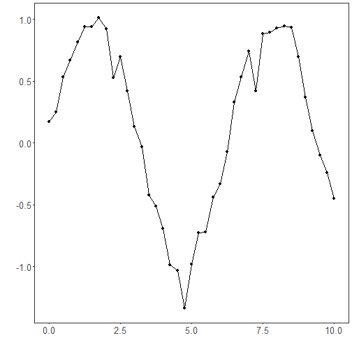
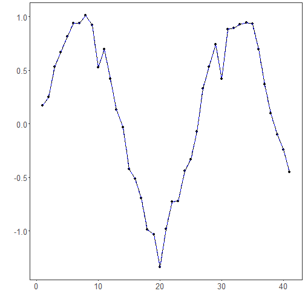

Overview

This generic smoothing filter reduces short-term variation to reveal the underlying signal. It can be used as a quick denoising step when you do not need a specific smoothing family (e.g., MA, LOWESS, spline).

Tip
- Start with the default settings; if the result under/over-smooths, consider a more tailored filter (e.g., spline with `spar`, LOWESS with `f`).


``` r
# Filter - Smooth

# Install tspredit if needed
#install.packages("tspredit")
```


``` r
# Load packages
library(daltoolbox)
library(tspredit) 
```


``` r
# Create a noisy example series
data(tsd)
y <- tsd$y
noise <- rnorm(length(y), 0, sd(y)/10)
spike <- rnorm(1, 0, sd(y))
tsd$y <- tsd$y + noise
tsd$y[10] <- tsd$y[10] + spike
tsd$y[20] <- tsd$y[20] + spike
tsd$y[30] <- tsd$y[30] + spike
```


``` r
library(ggplot2)
# Visualize noisy input
plot_ts(x=tsd$x, y=tsd$y) + theme(text = element_text(size=16))
```




``` r
# Apply generic smoothing

filter <- ts_fil_smooth()       # defaults provide light smoothing
filter <- fit(filter, tsd$y)
y <- transform(filter, tsd$y)

# Compare original vs smoothed
plot_ts_pred(y=tsd$y, yadj=y) + theme(text = element_text(size=16))
```



