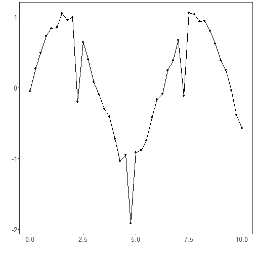
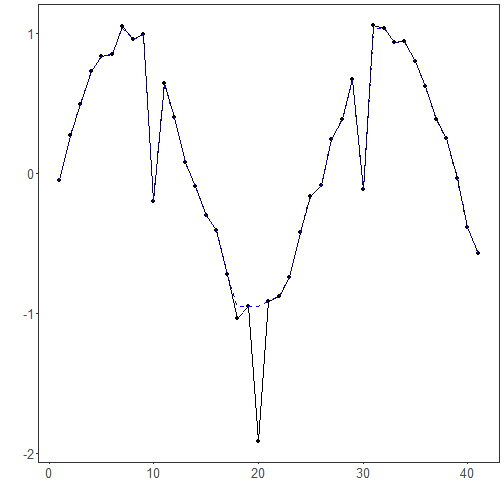

Winsorization filter: Winsorization limits extreme values to specified quantiles (e.g., 5th and 95th), reducing the influence of spikes without fully discarding observations. It is a simple robustification step prior to smoothing or modeling.

Objective: Apply Winsorization to limit extreme values and reduce the influence of outliers in the series.


``` r
# Filter - Winsorization

# Installing the package (if needed)
#install.packages("tspredit")
```


``` r
# Loading the packages
library(daltoolbox)
library(tspredit) 
```


``` r
# Series for study with artificial noise and spikes

data(tsd)
y <- tsd$y
noise <- rnorm(length(y), 0, sd(y)/10)
spike <- rnorm(1, 0, sd(y))
tsd$y <- tsd$y + noise
tsd$y[10] <- tsd$y[10] + spike
tsd$y[20] <- tsd$y[20] + spike
tsd$y[30] <- tsd$y[30] + spike
```


``` r
library(ggplot2)
# Noisy series visualization
plot_ts(x = tsd$x, y = tsd$y) + theme(text = element_text(size=16))
```




``` r
# Applying the Winsor filter

filter <- ts_fil_winsor()
filter <- fit(filter, tsd$y)
y <- transform(filter, tsd$y)
plot_ts_pred(y=tsd$y, yadj=y) + theme(text = element_text(size=16))
```



References
- R. R. Wilcox (2012). Introduction to Robust Estimation and Hypothesis Testing. Academic Press.
