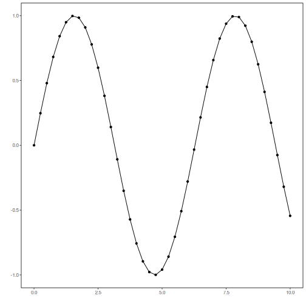

## mRMR Lag Mapping

About the technique
- `mrmr` greedily favors lags that are relevant to the target while reducing redundancy among already selected lags.
- It is a stronger supervised baseline than pure mutual-information ranking when many lagged attributes carry overlapping information.

Didactic goal: balance predictive relevance and diversity inside the chosen lag subset.


``` r
source(url("https://raw.githubusercontent.com/cefet-rj-dal/tspredit/main/examples/seed.R"))
# mRMR lag mapping
```


``` r
library(daltoolbox)
library(tspredit)
```


``` r
data(tsd)
plot_ts(x = tsd$x, y = tsd$y)
```




``` r
sw_size <- 10
ts <- ts_data(tsd$y, sw_size)
samp <- ts_sample(ts, test_size = 5)
io_train <- ts_projection(samp$train)
io_test <- ts_projection(samp$test)
```


``` r
mapper <- ts_lagmap(method = "mrmr", bins = 8)
mapper <- fit(mapper, io_train$input, io_train$output, input_size = 4)
mapper$lags
```

```
## [1] 9 6 5 2
```

``` r
mapper$columns
```

```
## [1] "t9" "t6" "t5" "t2"
```


``` r
model <- ts_knn(
  preprocess = ts_norm_gminmax(),
  input_size = 4,
  input_map = ts_lagmap(method = "mrmr", bins = 8),
  k = 3
)
set_example_seed()
model <- fit(model, io_train$input, io_train$output)
prediction <- predict(model, io_test$input[1, ], steps_ahead = 5)
evaluate(model, as.vector(io_test$output), as.vector(prediction))
```

```
## $values
## [1]  0.41211849  0.17388949 -0.07515112 -0.31951919 -0.54402111
## 
## $prediction
## [1]  0.5349524  0.1381953  0.1381953 -0.3435132 -0.3435132
## 
## $smape
## [1] 0.6024704
## 
## $mse
## [1] 0.02053161
## 
## $R2
## [1] 0.8226674
## 
## $metrics
##          mse     smape        R2
## 1 0.02053161 0.6024704 0.8226674
```
