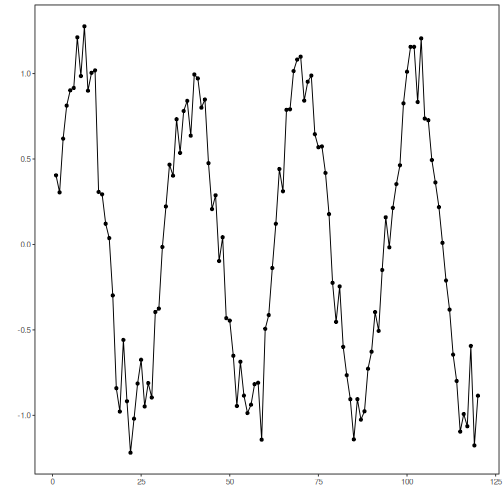
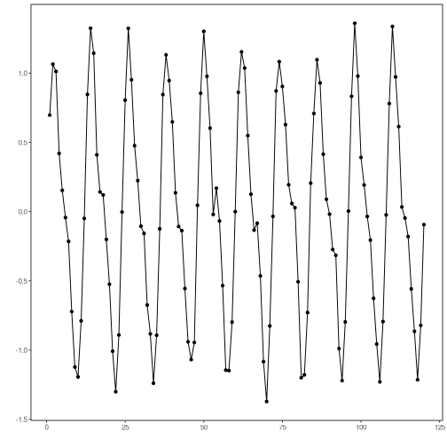
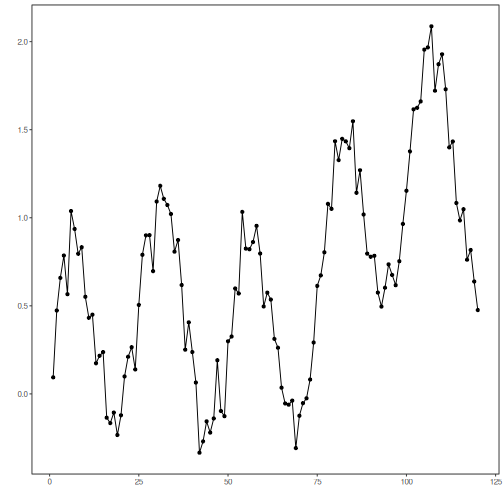
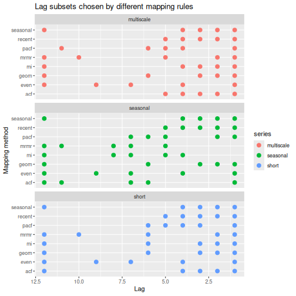

## Lag Mapping Comparison

About the comparison
- Different lag selectors emphasize different assumptions about temporal dependence.
- This notebook compares the resulting lag subsets on synthetic signals that isolate short-memory, seasonal, and multiscale behavior.

Didactic goal: visualize how the mapping families differ before they are coupled to a predictor.


``` r
source(url("https://raw.githubusercontent.com/cefet-rj-dal/tspredit/main/examples/seed.R"))
# Lag mapping comparison
```


``` r
library(daltoolbox)
library(tspredit)
library(ggplot2)
```


``` r
set_example_seed()

n <- 120
x <- 1:n

series_short <- sin(x / 5) + rnorm(n, sd = 0.15)
series_seasonal <- sin(2 * pi * x / 12) + 0.4 * sin(2 * pi * x / 6) + rnorm(n, sd = 0.1)
series_multiscale <- 0.6 * sin(x / 4) + 0.3 * sin(x / 13) + 0.01 * x + rnorm(n, sd = 0.12)

synthetic <- list(
  short = series_short,
  seasonal = series_seasonal,
  multiscale = series_multiscale
)
```


``` r
plot_ts(y = synthetic$short)
```



``` r
plot_ts(y = synthetic$seasonal)
```



``` r
plot_ts(y = synthetic$multiscale)
```




``` r
methods <- c("recent", "even", "geom", "acf", "pacf", "seasonal", "mi", "mrmr")

describe_map <- function(series_name, series_values) {
  ts <- ts_data(series_values, 13)
  io <- ts_projection(ts)

  do.call(rbind, lapply(methods, function(method_name) {
    mapper <- ts_lagmap(method = method_name, seasonality = 12)
    mapper <- fit(mapper, io$input, io$output, input_size = 5)
    data.frame(
      series = series_name,
      method = method_name,
      lag = mapper$lags
    )
  }))
}

mapping_df <- do.call(
  rbind,
  Map(describe_map, names(synthetic), synthetic)
)

mapping_df
```

```
##                   series   method lag
## short.1            short   recent   5
## short.2            short   recent   4
## short.3            short   recent   3
## short.4            short   recent   2
## short.5            short   recent   1
## short.6            short     even  12
## short.7            short     even   9
## short.8            short     even   7
## short.9            short     even   4
## short.10           short     even   1
## short.11           short     geom  12
## short.12           short     geom   6
## short.13           short     geom   3
## short.14           short     geom   2
## short.15           short     geom   1
## short.16           short      acf  12
## short.17           short      acf   4
## short.18           short      acf   3
## short.19           short      acf   2
## short.20           short      acf   1
## short.21           short     pacf   6
## short.22           short     pacf   5
## short.23           short     pacf   4
## short.24           short     pacf   3
## short.25           short     pacf   1
## short.26           short seasonal  12
## short.27           short seasonal   4
## short.28           short seasonal   3
## short.29           short seasonal   2
## short.30           short seasonal   1
## short.31           short       mi  12
## short.32           short       mi   6
## short.33           short       mi   3
## short.34           short       mi   2
## short.35           short       mi   1
## short.36           short     mrmr  12
## short.37           short     mrmr  10
## short.38           short     mrmr   6
## short.39           short     mrmr   2
## short.40           short     mrmr   1
## seasonal.1      seasonal   recent   5
## seasonal.2      seasonal   recent   4
## seasonal.3      seasonal   recent   3
## seasonal.4      seasonal   recent   2
## seasonal.5      seasonal   recent   1
## seasonal.6      seasonal     even  12
## seasonal.7      seasonal     even   9
## seasonal.8      seasonal     even   7
## seasonal.9      seasonal     even   4
## seasonal.10     seasonal     even   1
## seasonal.11     seasonal     geom  12
## seasonal.12     seasonal     geom   6
## seasonal.13     seasonal     geom   3
## seasonal.14     seasonal     geom   2
## seasonal.15     seasonal     geom   1
## seasonal.16     seasonal      acf  12
## seasonal.17     seasonal      acf  11
## seasonal.18     seasonal      acf   7
## seasonal.19     seasonal      acf   6
## seasonal.20     seasonal      acf   1
## seasonal.21     seasonal     pacf   7
## seasonal.22     seasonal     pacf   6
## seasonal.23     seasonal     pacf   5
## seasonal.24     seasonal     pacf   2
## seasonal.25     seasonal     pacf   1
## seasonal.26     seasonal seasonal  12
## seasonal.27     seasonal seasonal   4
## seasonal.28     seasonal seasonal   3
## seasonal.29     seasonal seasonal   2
## seasonal.30     seasonal seasonal   1
## seasonal.31     seasonal       mi  12
## seasonal.32     seasonal       mi   8
## seasonal.33     seasonal       mi   7
## seasonal.34     seasonal       mi   5
## seasonal.35     seasonal       mi   4
## seasonal.36     seasonal     mrmr  12
## seasonal.37     seasonal     mrmr  11
## seasonal.38     seasonal     mrmr   8
## seasonal.39     seasonal     mrmr   7
## seasonal.40     seasonal     mrmr   5
## multiscale.1  multiscale   recent   5
## multiscale.2  multiscale   recent   4
## multiscale.3  multiscale   recent   3
## multiscale.4  multiscale   recent   2
## multiscale.5  multiscale   recent   1
## multiscale.6  multiscale     even  12
## multiscale.7  multiscale     even   9
## multiscale.8  multiscale     even   7
## multiscale.9  multiscale     even   4
## multiscale.10 multiscale     even   1
## multiscale.11 multiscale     geom  12
## multiscale.12 multiscale     geom   6
## multiscale.13 multiscale     geom   3
## multiscale.14 multiscale     geom   2
## multiscale.15 multiscale     geom   1
## multiscale.16 multiscale      acf   5
## multiscale.17 multiscale      acf   4
## multiscale.18 multiscale      acf   3
## multiscale.19 multiscale      acf   2
## multiscale.20 multiscale      acf   1
## multiscale.21 multiscale     pacf  11
## multiscale.22 multiscale     pacf   6
## multiscale.23 multiscale     pacf   5
## multiscale.24 multiscale     pacf   4
## multiscale.25 multiscale     pacf   1
## multiscale.26 multiscale seasonal  12
## multiscale.27 multiscale seasonal   4
## multiscale.28 multiscale seasonal   3
## multiscale.29 multiscale seasonal   2
## multiscale.30 multiscale seasonal   1
## multiscale.31 multiscale       mi  12
## multiscale.32 multiscale       mi   4
## multiscale.33 multiscale       mi   3
## multiscale.34 multiscale       mi   2
## multiscale.35 multiscale       mi   1
## multiscale.36 multiscale     mrmr  12
## multiscale.37 multiscale     mrmr  10
## multiscale.38 multiscale     mrmr   5
## multiscale.39 multiscale     mrmr   2
## multiscale.40 multiscale     mrmr   1
```


``` r
ggplot(mapping_df, aes(x = lag, y = method, color = series)) +
  geom_point(size = 3) +
  facet_wrap(~series, ncol = 1) +
  scale_x_reverse() +
  labs(
    title = "Lag subsets chosen by different mapping rules",
    x = "Lag",
    y = "Mapping method"
  )
```


