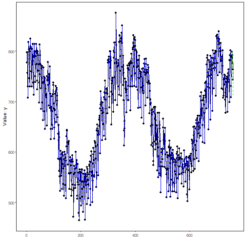
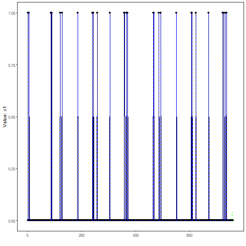
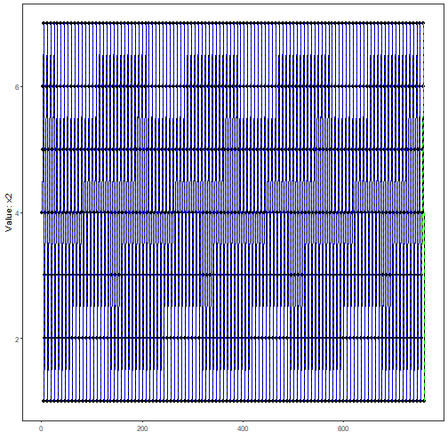

## Target-Centered Multivariate Forecasting

About the method
- This workflow keeps `y` as the forecasting target and treats `x1, ..., xn` as auxiliary series that also receive their own predictive pipelines.
- The multivariate wrapper reuses the univariate learners already available in `tspredit`, while coordinating how the synchronized lagged windows are built for each variable.

Didactic goal: provide a first overview of how multivariate forecasting works in `tspredit` 2.0 using an existing benchmark from the package.


``` r
source(url("https://raw.githubusercontent.com/cefet-rj-dal/tspredit/main/examples/seed.R"))
# Target-centered multivariate forecasting

# Installing the package (if needed)
# install.packages("tspredit")
```

We begin by loading the packages used in the example.


``` r
library(daltoolbox)
```

```
## Warning: pacote 'daltoolbox' foi compilado no R versão 4.5.1
```

```
## 
## Anexando pacote: 'daltoolbox'
```

```
## O seguinte objeto é mascarado por 'package:base':
## 
##     transform
```

``` r
library(tspredit)
```

```
## Registered S3 method overwritten by 'quantmod':
##   method            from
##   as.zoo.data.frame zoo
```

We now build an aligned multivariate dataset from benchmark data already
available in `tspredit`. We use:

- the daily maximum load extracted from `EUNITE.Loads` as the target `y`
- the holiday indicator from `EUNITE.Reg` as `x1`
- the weekday code from `EUNITE.Reg` as `x2`


``` r
data(EUNITE.Loads)
data(EUNITE.Reg)

if (!is.null(attr(EUNITE.Loads, "url"))) {
  EUNITE.Loads <- loadfulldata(EUNITE.Loads)
}
if (!is.null(attr(EUNITE.Reg, "url"))) {
  EUNITE.Reg <- loadfulldata(EUNITE.Reg)
}

load_cols <- setdiff(names(EUNITE.Loads), "split")
y <- apply(EUNITE.Loads[, load_cols, drop = FALSE], 1, max)
x1 <- as.numeric(EUNITE.Reg$Holiday)
x2 <- as.numeric(EUNITE.Reg$Weekday)

mv <- ts_data_mv(
  data.frame(
    y = y,
    x1 = x1,
    x2 = x2
  ),
  y = "y"
)

ts_head(mv, 3)
```

```
##     y x1 x2
## 1 797  1  4
## 2 777  0  5
## 3 797  0  6
```

The multivariate object preserves the temporal alignment across all variables
and can be split in time just like the univariate workflow.


``` r
samp <- ts_sample(mv, test_size = 5)
```

We now define one specification for the target and one specification for each
auxiliary variable. Each specification can use a different learner, different
lag usage, and different raw-series transformations.


``` r
model <- ts_regsw_mv(
  model_y = ts_mv_spec(
    ts_mlp(ts_norm_an(), input_size = 4, size = 4, decay = 0),
    variables = c("y", "x1", "x2"),
    transforms = list(y = ts_fil_ma(3))
  ),
  models_x = list(
    x1 = ts_mv_spec(ts_arima()),
    x2 = ts_mv_spec(
      ts_rf(ts_norm_gminmax(), input_size = 4, ntree = 20),
      variables = c("x2", "y"),
      transforms = list(y = ts_fil_ma(3))
    )
  ),
  window_size = 7
)
```

We fit the composed multivariate forecasting system on the training portion of
the aligned series.


``` r
set_example_seed()
model <- fit(model, samp$train)
```

The first forecast mode is one-step ahead. It returns the next value of the
target series.


``` r
pred_1 <- predict(model, steps_ahead = 1)
pred_1
```

```
## [1] 799.6176
```

The second forecast mode is recursive multi-step prediction. By default, it
returns the future path of `y`.


``` r
pred_5 <- predict(model, steps_ahead = 5)
pred_5
```

```
## [1] 799.6176 789.9847 783.9372 754.9339 712.4487
```

If we want to inspect the whole recursive system, we can ask for the target and
the auxiliary forecasts together.


``` r
pred_all <- predict(model, steps_ahead = 5, return_all = TRUE)
pred_all
```

```
## $y
## [1] 799.6176 789.9847 783.9372 754.9339 712.4487
## 
## $x
## $x$x1
## [1] 0.03349291 0.03591705 0.04017507 0.04198686 0.04182131
## 
## $x$x2
## [1] 4 5 6 7 1
## 
## 
## attr(,"class")
## [1] "ts_mv_prediction"
## attr(,"y_name")
## [1] "y"
## attr(,"x_names")
## [1] "x1" "x2"
## attr(,"variables")
## [1] "y"  "x1" "x2"
## attr(,"steps_ahead")
## [1] 5
```

The multivariate plotting helper reuses the same visual language already used
throughout the univariate examples, but now it returns one plot per variable.


``` r
plots <- plot_ts_pred_mv(samp$train, samp$test, pred_all)
```

Target trajectory:


``` r
plots$y
```



Auxiliary variable `x1`:


``` r
plots$x1
```



Auxiliary variable `x2`:


``` r
plots$x2
```



The held-out target values remain available for evaluation against the target
forecast.


``` r
output <- tail(samp$test$y, 5)
ev_test <- evaluate(model, output, pred_5)
ev_test$metrics
```

```
##        mse      smape        R2
## 1 266.6579 0.01830764 0.2129343
```

What this example shows
- `ts_data_mv()` preserves synchronized multivariate observations before any lag expansion happens.
- `ts_mv_spec()` lets each variable keep its own object-oriented pipeline.
- `ts_regsw_mv()` coordinates one target model and one auxiliary model per covariate while reusing the learners already available in the univariate package.

References
- Hyndman, R. J., & Athanasopoulos, G. Forecasting: Principles and Practice.
- Salles, R., Pacitti, E., Bezerra, E., Marques, C., Pacheco, C., Oliveira, C., Porto, F., Ogasawara, E. (2023). TSPredIT: Integrated Tuning of Data Preprocessing and Time Series Prediction Models.
