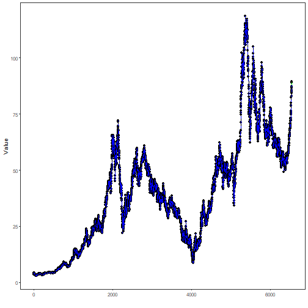
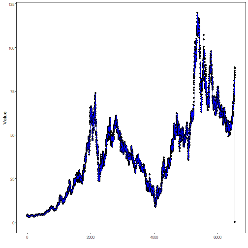
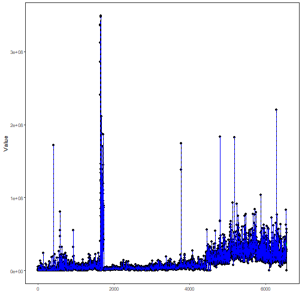

## Stock Closing-Price Forecasting with Non-Deterministic Auxiliaries

About the method
- This workflow keeps `close` as the forecasting target and treats `open`, `high`, `low`, and `volume` as non-deterministic auxiliary variables.
- Unlike the previous example, the auxiliary variables are not governed by a fixed law of formation. They need their own forecasting models.

Didactic goal: compare a direct `ARIMA` baseline on the closing price against a target-centered multivariate workflow whose auxiliary variables mix `ts_mlp()`, `ts_elm()`, `ts_darima()`, and `ts_warma()`.


``` r
source(url("https://raw.githubusercontent.com/cefet-rj-dal/tspredit/main/examples/seed.R"))
# Stock closing-price forecasting with non-deterministic auxiliaries

# Installing the package (if needed)
# install.packages("tspredit")
```


``` r
library(daltoolbox)
library(tspredit)
```

We now switch to a different multivariate scenario. Instead of deterministic
calendar auxiliaries, we use market variables from the packaged `stocks`
collection. The target is the closing price, while the other fields behave as
non-deterministic auxiliary series.


``` r
data(stocks)

if (!is.null(attr(stocks, "url"))) {
  stocks <- loadfulldata(stocks)
}

ticker_name <- if ("VALE3" %in% names(stocks)) "VALE3" else names(stocks)[1]
ticker <- stocks[[ticker_name]]
ticker <- ticker[, c("open", "high", "low", "close", "volume")]
ticker <- stats::na.omit(ticker)

mv <- ts_data_mv(
  ticker,
  y = "close",
  x = c("open", "high", "low", "volume")
)

ts_head(mv, 3)
```

```
##      close     open     high      low  volume
## 1 3.500000 3.500000 3.542500 3.500000  585600
## 2 3.416666 3.466666 3.474166 3.416666  782400
## 3 3.416666 3.375000 3.416666 3.375000 1876800
```

The aligned object can now be split in time just like any other target-centered
multivariate dataset.


``` r
samp <- ts_sample(mv, test_size = 5)
```

Before introducing the multivariate workflow, we build a direct univariate
baseline on the closing price itself. This keeps the interpretation honest: we
first ask how far a classical `ARIMA` can go before bringing in the auxiliary
variables.


``` r
close_ts <- ts_data(ticker$close, 1)
close_samp <- ts_sample(close_ts, test_size = 5)

arima_baseline <- ts_arima()
arima_baseline <- fit(arima_baseline, x = close_samp$train)

pred_arima <- predict(arima_baseline, x = close_samp$test[1,], steps_ahead = 5)
pred_arima <- as.vector(pred_arima)
ev_arima <- evaluate(arima_baseline, as.vector(close_samp$test), pred_arima)
ev_arima$metrics
```

```
##        mse      smape        R2
## 1 4.904158 0.02269408 -2.053065
```

This time, the auxiliary variables are not deterministic. We therefore assign
real forecasting models to them. After a few trial configurations, a `Random
Forest` worked better as the target learner for this particular stock holdout,
while the auxiliaries remain intentionally heterogeneous:

- `open` uses `ELM`
- `high` uses `DARIMA`
- `low` uses `MLP`
- `volume` uses `WARMA`


``` r
model <- ts_regsw_mv(
  model_y = ts_mv_spec(
    ts_rf(ts_norm_gminmax(), input_size = 4),
    variables = c("close", "open", "high", "low")
  ),
  models_x = list(
    open = ts_mv_spec(
      ts_elm(ts_norm_gminmax(), input_size = 3, nhid = 3, actfun = "purelin"),
      variables = c("open", "close", "high")
    ),
    high = ts_mv_spec(
      ts_darima(ts_norm_diff(), input_size = 3),
      variables = c("high", "close", "open")
    ),
    low = ts_mv_spec(
      ts_mlp(ts_norm_gminmax(), input_size = 3, size = 2, decay = 0.1),
      variables = c("low", "close", "open")
    ),
    volume = ts_mv_spec(
      ts_warma(input_size = 3, steps = 1),
      variables = c("volume")
    )
  ),
  window_size = 5
)
```

This mixed specification also clarifies an important point of the current API:
the univariate support models used inside `ts_regsw_mv` do not need to be all
of the same family. Here:

- `ts_rf()` gives a more stable target learner for this stock example
- `ts_elm()` offers a lighter neural alternative for one auxiliary variable
- `ts_darima()` acts as a lightweight ARIMA-like learner in the
  sliding-window world, with differencing delegated to preprocessing
- `ts_mlp()` remains available as a nonlinear auxiliary learner
- `ts_warma()` acts as a local-normalization competitor in the same
  `ts_regsw` lineage


``` r
set_example_seed()
model <- fit(model, samp$train)
```

We first inspect the next closing-price forecast.


``` r
pred_1 <- predict(model, steps_ahead = 1)
pred_1
```

```
## [1] 88.5635
```

We then inspect the recursive multi-step path for the target.


``` r
pred_5 <- predict(model, steps_ahead = 5)
pred_5
```

```
## [1] 88.5635 87.4750 87.6003 87.4603 87.5465
```

And finally the full recursive system, including the auxiliary predictions.


``` r
pred_all <- predict(model, steps_ahead = 5, return_all = TRUE)
pred_all
```

```
## $y
## [1] 88.5635 87.4750 87.6003 87.4603 87.5465
## 
## $x
## $x$open
## [1] 85.80139 88.61880 89.57019 87.88007 88.15521
## 
## $x$high
## [1] 90.64456 90.82650 89.66789 89.05472 89.18879
## 
## $x$low
## [1] 86.76855 86.95671 86.91732 87.05260 86.91490
## 
## $x$volume
## [1] 34433500 35625440 34347888 32881186 34999543
## 
## 
## attr(,"class")
## [1] "ts_mv_prediction"
## attr(,"y_name")
## [1] "close"
## attr(,"x_names")
## [1] "open"   "high"   "low"    "volume"
## attr(,"variables")
## [1] "close"  "open"   "high"   "low"    "volume"
## attr(,"steps_ahead")
## [1] 5
```

To keep the notebook readable, we plot the target and two representative
auxiliaries.


``` r
plot_close <- plot_ts_pred_mv(samp$train, samp$test, pred_all, variable = "close")
plot_open <- plot_ts_pred_mv(samp$train, samp$test, pred_all, variable = "open")
plot_volume <- plot_ts_pred_mv(samp$train, samp$test, pred_all, variable = "volume")
```

Target trajectory:


``` r
plot_close
```



Auxiliary variable `open`:


``` r
plot_open
```



Auxiliary variable `volume`:


``` r
plot_volume
```



The held-out target values remain available for evaluation against the target
forecast.


``` r
output <- tail(samp$test$close, 5)
ev_test <- evaluate(model, output, pred_5)
ev_test$metrics
```

```
##       mse      smape        R2
## 1 1.19053 0.01033564 0.2588403
```

We can now compare the direct closing-price baseline against the multivariate
workflow on the same five-step horizon.


``` r
rbind(
  ARIMA_close = ev_arima$metrics,
  MV_mixed = ev_test$metrics
)
```

```
##                  mse      smape         R2
## ARIMA_close 4.904158 0.02269408 -2.0530650
## MV_mixed    1.190530 0.01033564  0.2588403
```

What this example shows
- `stocks` provides a natural target-centered multivariate scenario with non-deterministic auxiliary variables.
- A direct `ARIMA` on the closing price remains an important baseline and should be checked before moving to a richer multivariate design.
- Auxiliary variables do not need to share the same learner: some can use `ts_elm()`, others can use `ts_mlp()`, `ts_darima()`, or `ts_warma()`.
- `ts_darima()` and `ts_warma()` are useful support models for the target-centered multivariate workflow because they already live in the `ts_regsw` lineage.
- This is a different scenario from the previous deterministic-auxiliary example: here the auxiliary variables must themselves be forecast as evolving stochastic series.
