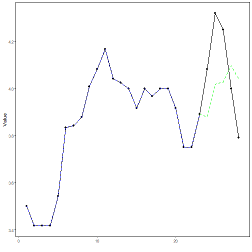

## Stock Closing-Price Forecasting with KNN as Target Learner

About the method
- This example continues the stock-closing-price scenario from the previous notebook.
- The multivariate setting is kept fixed, but now the target `close` is forecast with `ts_knn()`.

Didactic goal: inspect how the KNN regressor behaves as the target learner inside the target-centered multivariate workflow.


``` r
source(url("https://raw.githubusercontent.com/cefet-rj-dal/tspredit/main/examples/seed.R"))
# Stock closing-price forecasting with KNN as target learner

# Installing packages (if needed)
# install.packages("tspredit")
```


``` r
library(daltoolbox)
library(tspredit)
```

We keep the same stock scenario, but for a faster didactic run we retain only
the last two years of valid observations.


``` r
data(stocks)

if (!is.null(attr(stocks, "url"))) {
  stocks <- loadfulldata(stocks)
}
```

```
## Warning in .rs.downloadFile(url = url, destfile = tf, quiet = TRUE, mode = "wb"): downloaded length 2371566 != reported
## length 3229450
```

```
## Warning in .rs.downloadFile(url = url, destfile = tf, quiet = TRUE, mode = "wb"): URL
## 'https://raw.githubusercontent.com/cefet-rj-dal/tspredbench/refs/heads/main/tspredit/stocks.RData': Timeout of 60
## seconds was reached
```

```
## Error in `.rs.downloadFile()`:
## ! download from 'https://raw.githubusercontent.com/cefet-rj-dal/tspredbench/refs/heads/main/tspredit/stocks.RData' failed
```

``` r
ticker_name <- if ("VALE3" %in% names(stocks)) "VALE3" else names(stocks)[1]
ticker <- stocks[[ticker_name]]
ticker <- ticker[, c("date", "open", "high", "low", "close", "volume")]
ticker <- stats::na.omit(ticker)
ticker <- subset(ticker, open > 0 & high > 0 & low > 0 & volume > 0)
cutoff_date <- max(ticker$date) - 365 * 2
ticker <- ticker[ticker$date > cutoff_date, ]

mv <- ts_data_mv(
  ticker[, c("open", "high", "low", "close", "volume")],
  y = "close",
  x = c("open", "high", "low", "volume")
)

ts_head(mv, 3)
```

```
##      close     open     high      low  volume
## 1 3.500000 3.500000 3.542500 3.500000  585600
## 2 3.416666 3.466666 3.474166 3.416666  782400
## 3 3.416666 3.375000 3.416666 3.375000 1876800
```

``` r
nrow(ticker)
```

```
## [1] 28
```


``` r
samp <- ts_sample(mv, test_size = 5)
output <- tail(samp$test$close, 5)
```

From this point on, the stock examples follow the same experimental line:

- keep the same dataset, split, and window size
- change only the learner family
- use the same learner family for the target and for all endogenous auxiliaries
- inspect `pred_1`, `pred_5`, the synchronized forecast table, the target plot,
  and the target metrics

To keep the example easier to understand, the endogenous auxiliary variables use
the same model family as the target learner. Only the variable roles change.


``` r
model <- ts_regsw_mv(
  model_y = ts_mv_spec(
    ts_knn(ts_norm_gminmax(), input_size = 4, k = 3),
    variables = c("close", "open", "high", "low")
  ),
  models_x = list(
    open = ts_mv_spec(
      ts_knn(ts_norm_gminmax(), input_size = 3, k = 3),
      variables = c("open", "close", "high")
    ),
    high = ts_mv_spec(
      ts_knn(ts_norm_gminmax(), input_size = 3, k = 3),
      variables = c("high", "close", "open")
    ),
    low = ts_mv_spec(
      ts_knn(ts_norm_gminmax(), input_size = 3, k = 3),
      variables = c("low", "close", "open")
    ),
    volume = ts_mv_spec(
      ts_knn(ts_norm_gminmax(), input_size = 3, k = 3),
      variables = c("volume", "close", "open")
    )
  ),
  window_size = 5
)
```


``` r
set_example_seed()
model <- fit(model, samp$train)
pred_1 <- predict(model, steps_ahead = 1)
pred_1
```

```
## [1] 3.880555
## attr(,"y_name")
## [1] "close"
## attr(,"x_names")
## [1] "open"   "high"   "low"    "volume"
## attr(,"variables")
## [1] "close"  "open"   "high"   "low"    "volume"
## attr(,"steps_ahead")
## [1] 1
## attr(,"prediction_x")
## attr(,"prediction_x")$open
## [1] 3.833333
## 
## attr(,"prediction_x")$high
## [1] 3.922222
## 
## attr(,"prediction_x")$low
## [1] 3.819444
## 
## attr(,"prediction_x")$volume
## [1] 408000
## 
## attr(,"system")
##      close     open     high      low volume
## 1 3.880555 3.833333 3.922222 3.819444 408000
## attr(,"class")
## [1] "ts_mv_prediction" "numeric"
```


``` r
pred_5 <- predict(model, steps_ahead = 5)
pred_5
```

```
## [1] 3.880555 4.019444 4.027777 4.097222 4.041666
## attr(,"y_name")
## [1] "close"
## attr(,"x_names")
## [1] "open"   "high"   "low"    "volume"
## attr(,"variables")
## [1] "close"  "open"   "high"   "low"    "volume"
## attr(,"steps_ahead")
## [1] 5
## attr(,"prediction_x")
## attr(,"prediction_x")$open
## [1] 3.833333 3.847222 4.000000 4.075278 4.069444
## 
## attr(,"prediction_x")$high
## [1] 3.922222 3.963888 4.027777 4.125000 4.097222
## 
## attr(,"prediction_x")$low
## [1] 3.819444 3.944444 4.005833 4.041944 4.008333
## 
## attr(,"prediction_x")$volume
## [1]  408000 1808000 1726400  342400  366400
## 
## attr(,"system")
##      close     open     high      low  volume
## 1 3.880555 3.833333 3.922222 3.819444  408000
## 2 4.019444 3.847222 3.963888 3.944444 1808000
## 3 4.027777 4.000000 4.027777 4.005833 1726400
## 4 4.097222 4.075278 4.125000 4.041944  342400
## 5 4.041666 4.069444 4.097222 4.008333  366400
## attr(,"class")
## [1] "ts_mv_prediction" "numeric"
```


``` r
attr(pred_5, "system")
```

```
##      close     open     high      low  volume
## 1 3.880555 3.833333 3.922222 3.819444  408000
## 2 4.019444 3.847222 3.963888 3.944444 1808000
## 3 4.027777 4.000000 4.027777 4.005833 1726400
## 4 4.097222 4.075278 4.125000 4.041944  342400
## 5 4.041666 4.069444 4.097222 4.008333  366400
```


``` r
ev_test <- evaluate(model, output, pred_5)
ev_test$metrics
```

```
##          mse      smape         R2
## 1 0.05074129 0.05299035 -0.4372322
```


``` r
plot_ts_pred_mv(samp$train, samp$test, pred_5, variable = "close")
```



What this example shows
- `ts_knn()` can be reused directly as the target learner inside `ts_regsw_mv()`.
- The same learner family can be reused for the target and for all endogenous auxiliaries when the goal is a cleaner didactic comparison.
