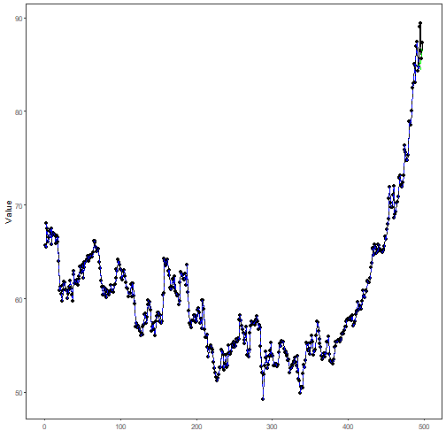

## Stock Closing-Price Forecasting with SVM as Target Learner

About the method
- This example keeps the same stock-closing-price scenario, but now the target `close` is forecast with `ts_svm()`.

Didactic goal: inspect how support-vector regression behaves as the target learner inside the target-centered multivariate workflow.


``` r
source(url("https://raw.githubusercontent.com/cefet-rj-dal/tspredit/main/examples/seed.R"))
# Stock closing-price forecasting with SVM as target learner

# Installing packages (if needed)
# install.packages("tspredit")
```


``` r
library(daltoolbox)
library(tspredit)
```


``` r
data(stocks)

if (!is.null(attr(stocks, "url"))) {
  stocks <- loadfulldata(stocks)
}

ticker_name <- if ("VALE3" %in% names(stocks)) "VALE3" else names(stocks)[1]
ticker <- stocks[[ticker_name]]
ticker <- ticker[, c("date", "open", "high", "low", "close", "volume")]
ticker <- stats::na.omit(ticker)
ticker <- subset(ticker, open > 0 & high > 0 & low > 0 & volume > 0)
cutoff_date <- max(ticker$date) - 365 * 2
ticker <- ticker[ticker$date > cutoff_date, ]

mv <- ts_data_mv(
  ticker[, c("open", "high", "low", "close", "volume")],
  y = "close",
  x = c("open", "high", "low", "volume")
)

samp <- ts_sample(mv, test_size = 5)
output <- tail(samp$test$close, 5)
```


``` r
model <- ts_regsw_mv(
  model_y = ts_mv_spec(
    ts_svm(ts_norm_gminmax(), input_size = 4),
    variables = c("close", "open", "high", "low")
  ),
  models_x = list(
    open = ts_mv_spec(
      ts_svm(ts_norm_gminmax(), input_size = 3),
      variables = c("open", "close", "high")
    ),
    high = ts_mv_spec(
      ts_svm(ts_norm_gminmax(), input_size = 3),
      variables = c("high", "close", "open")
    ),
    low = ts_mv_spec(
      ts_svm(ts_norm_gminmax(), input_size = 3),
      variables = c("low", "close", "open")
    ),
    volume = ts_mv_spec(
      ts_svm(ts_norm_gminmax(), input_size = 3),
      variables = c("volume", "close", "open")
    )
  ),
  window_size = 5
)
```


``` r
set_example_seed()
model <- fit(model, samp$train)
pred_1 <- predict(model, steps_ahead = 1)
pred_1
```

```
## [1] 85.43073
## attr(,"y_name")
## [1] "close"
## attr(,"x_names")
## [1] "open"   "high"   "low"    "volume"
## attr(,"variables")
## [1] "close"  "open"   "high"   "low"    "volume"
## attr(,"steps_ahead")
## [1] 1
## attr(,"prediction_x")
## attr(,"prediction_x")$open
## [1] 83.95606
## 
## attr(,"prediction_x")$high
## [1] 85.50048
## 
## attr(,"prediction_x")$low
## [1] 83.45159
## 
## attr(,"prediction_x")$volume
## [1] 32904634
## 
## attr(,"system")
##      close     open     high      low   volume
## 1 85.43073 83.95606 85.50048 83.45159 32904634
## attr(,"class")
## [1] "ts_mv_prediction" "numeric"
```


``` r
pred_5 <- predict(model, steps_ahead = 5)
pred_5
```

```
## [1] 85.43073 85.42681 84.46338 86.64204 86.21464
## attr(,"y_name")
## [1] "close"
## attr(,"x_names")
## [1] "open"   "high"   "low"    "volume"
## attr(,"variables")
## [1] "close"  "open"   "high"   "low"    "volume"
## attr(,"steps_ahead")
## [1] 5
## attr(,"prediction_x")
## attr(,"prediction_x")$open
## [1] 83.95606 83.93753 84.21302 85.65800 86.84039
## 
## attr(,"prediction_x")$high
## [1] 85.50048 86.30843 86.57118 87.96347 88.67614
## 
## attr(,"prediction_x")$low
## [1] 83.45159 84.31085 83.37404 85.79971 85.06113
## 
## attr(,"prediction_x")$volume
## [1] 32904634 46739021 35982840 26846961 40740718
## 
## attr(,"system")
##      close     open     high      low   volume
## 1 85.43073 83.95606 85.50048 83.45159 32904634
## 2 85.42681 83.93753 86.30843 84.31085 46739021
## 3 84.46338 84.21302 86.57118 83.37404 35982840
## 4 86.64204 85.65800 87.96347 85.79971 26846961
## 5 86.21464 86.84039 88.67614 85.06113 40740718
## attr(,"class")
## [1] "ts_mv_prediction" "numeric"
```


``` r
attr(pred_5, "system")
```

```
##      close     open     high      low   volume
## 1 85.43073 83.95606 85.50048 83.45159 32904634
## 2 85.42681 83.93753 86.30843 84.31085 46739021
## 3 84.46338 84.21302 86.57118 83.37404 35982840
## 4 86.64204 85.65800 87.96347 85.79971 26846961
## 5 86.21464 86.84039 88.67614 85.06113 40740718
```


``` r
ev_test <- evaluate(model, output, pred_5)
ev_test$metrics
```

```
##        mse      smape        R2
## 1 6.972927 0.02684439 -2.301171
```


``` r
plot_ts_pred_mv(samp$train, samp$test, pred_5, variable = "close")
```



What this example shows
- `ts_svm()` can be reused directly as the target learner inside `ts_regsw_mv()`.
- The same learner family can be reused for the target and for all endogenous auxiliaries when the goal is a cleaner didactic comparison.
