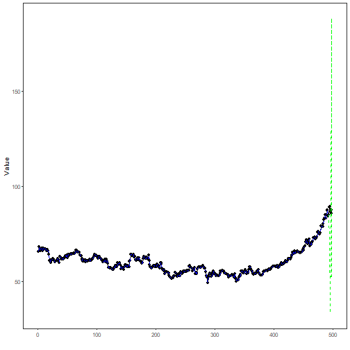

## Stock Closing-Price Forecasting with MLP as Target Learner

About the method
- This example keeps the same stock-closing-price scenario, but now the target `close` is forecast with `ts_mlp()`.

Didactic goal: inspect how a multilayer perceptron behaves as the target learner inside the target-centered multivariate workflow.


``` r
source(url("https://raw.githubusercontent.com/cefet-rj-dal/tspredit/main/examples/seed.R"))
# Stock closing-price forecasting with MLP as target learner

# Installing packages (if needed)
# install.packages("tspredit")
```


``` r
library(daltoolbox)
library(tspredit)
```


``` r
data(stocks)

if (!is.null(attr(stocks, "url"))) {
  stocks <- loadfulldata(stocks)
}

ticker_name <- if ("VALE3" %in% names(stocks)) "VALE3" else names(stocks)[1]
ticker <- stocks[[ticker_name]]
ticker <- ticker[, c("date", "open", "high", "low", "close", "volume")]
ticker <- stats::na.omit(ticker)
ticker <- subset(ticker, open > 0 & high > 0 & low > 0 & volume > 0)
cutoff_date <- max(ticker$date) - 365 * 2
ticker <- ticker[ticker$date > cutoff_date, ]

mv <- ts_data_mv(
  ticker[, c("open", "high", "low", "close", "volume")],
  y = "close",
  x = c("open", "high", "low", "volume")
)

samp <- ts_sample(mv, test_size = 5)
output <- tail(samp$test$close, 5)
```


``` r
model <- ts_regsw_mv(
  model_y = ts_mv_spec(
    ts_mlp(ts_norm_gminmax(), input_size = 4, size = 4, decay = 0),
    variables = c("close", "open", "high", "low")
  ),
  models_x = list(
    open = ts_mv_spec(
      ts_mlp(ts_norm_gminmax(), input_size = 3, size = 4, decay = 0),
      variables = c("open", "close", "high")
    ),
    high = ts_mv_spec(
      ts_mlp(ts_norm_gminmax(), input_size = 3, size = 4, decay = 0),
      variables = c("high", "close", "open")
    ),
    low = ts_mv_spec(
      ts_mlp(ts_norm_gminmax(), input_size = 3, size = 4, decay = 0),
      variables = c("low", "close", "open")
    ),
    volume = ts_mv_spec(
      ts_mlp(ts_norm_gminmax(), input_size = 3, size = 4, decay = 0),
      variables = c("volume", "close", "open")
    )
  ),
  window_size = 5
)
```


``` r
set_example_seed()
model <- fit(model, samp$train)
pred_1 <- predict(model, steps_ahead = 1)
pred_1
```

```
## [1] 72.69532
## attr(,"y_name")
## [1] "close"
## attr(,"x_names")
## [1] "open"   "high"   "low"    "volume"
## attr(,"variables")
## [1] "close"  "open"   "high"   "low"    "volume"
## attr(,"steps_ahead")
## [1] 1
## attr(,"prediction_x")
## attr(,"prediction_x")$open
## [1] 85.05918
## 
## attr(,"prediction_x")$high
## [1] 85.29949
## 
## attr(,"prediction_x")$low
## [1] 81.44817
## 
## attr(,"prediction_x")$volume
## [1] 21877063
## 
## attr(,"system")
##      close     open     high      low   volume
## 1 72.69532 85.05918 85.29949 81.44817 21877063
## attr(,"class")
## [1] "ts_mv_prediction" "numeric"
```


``` r
pred_5 <- predict(model, steps_ahead = 5)
pred_5
```

```
## [1]  72.69532  32.90832  70.70014 188.45650  51.03202
## attr(,"y_name")
## [1] "close"
## attr(,"x_names")
## [1] "open"   "high"   "low"    "volume"
## attr(,"variables")
## [1] "close"  "open"   "high"   "low"    "volume"
## attr(,"steps_ahead")
## [1] 5
## attr(,"prediction_x")
## attr(,"prediction_x")$open
## [1]  85.05918  38.60900 -73.25965  73.60015  51.60219
## 
## attr(,"prediction_x")$high
## [1]   85.2994888   72.5576631   50.9842936 -142.8079115   -0.8722029
## 
## attr(,"prediction_x")$low
## [1]  81.44817  73.67211 -91.78459 200.51619 -26.27833
## 
## attr(,"prediction_x")$volume
## [1] 21877063 25529676 29695572 25579320 28693895
## 
## attr(,"system")
##       close      open         high       low   volume
## 1  72.69532  85.05918   85.2994888  81.44817 21877063
## 2  32.90832  38.60900   72.5576631  73.67211 25529676
## 3  70.70014 -73.25965   50.9842936 -91.78459 29695572
## 4 188.45650  73.60015 -142.8079115 200.51619 25579320
## 5  51.03202  51.60219   -0.8722029 -26.27833 28693895
## attr(,"class")
## [1] "ts_mv_prediction" "numeric"
```


``` r
attr(pred_5, "system")
```

```
##       close      open         high       low   volume
## 1  72.69532  85.05918   85.2994888  81.44817 21877063
## 2  32.90832  38.60900   72.5576631  73.67211 25529676
## 3  70.70014 -73.25965   50.9842936 -91.78459 29695572
## 4 188.45650  73.60015 -142.8079115 200.51619 25579320
## 5  51.03202  51.60219   -0.8722029 -26.27833 28693895
```


``` r
ev_test <- evaluate(model, output, pred_5)
ev_test$metrics
```

```
##        mse     smape       R2
## 1 3119.531 0.5201632 -1475.87
```


``` r
plot_ts_pred_mv(samp$train, samp$test, pred_5, variable = "close")
```



What this example shows
- `ts_mlp()` can be reused directly as the target learner inside `ts_regsw_mv()`.
- The same learner family can be reused for the target and for all endogenous auxiliaries when the goal is a cleaner didactic comparison.
