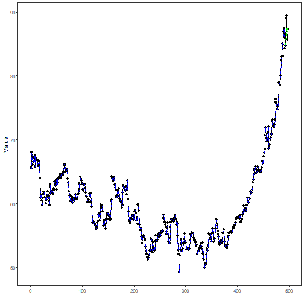

## Stock Closing-Price Forecasting with Conv1D as Target Learner

About the method
- This example keeps the same stock-closing-price scenario, but now the target `close` is forecast with `ts_conv1d()`.

Didactic goal: inspect how a 1D convolutional network behaves as the target learner inside the target-centered multivariate workflow.


``` r
source(url("https://raw.githubusercontent.com/cefet-rj-dal/tspredit/main/examples/seed.R"))
# Stock closing-price forecasting with Conv1D as target learner

# Installing packages (if needed)
# install.packages("tspredit")
```


``` r
library(daltoolbox)
library(daltoolboxdp)
```

```
## Warning: pacote 'daltoolboxdp' foi compilado no R versão 4.5.3
```

``` r
library(tspredit)
```


``` r
data(stocks)

if (!is.null(attr(stocks, "url"))) {
  stocks <- loadfulldata(stocks)
}

ticker_name <- if ("VALE3" %in% names(stocks)) "VALE3" else names(stocks)[1]
ticker <- stocks[[ticker_name]]
ticker <- ticker[, c("date", "open", "high", "low", "close", "volume")]
ticker <- stats::na.omit(ticker)
ticker <- subset(ticker, open > 0 & high > 0 & low > 0 & volume > 0)
cutoff_date <- max(ticker$date) - 365 * 2
ticker <- ticker[ticker$date > cutoff_date, ]

mv <- ts_data_mv(
  ticker[, c("open", "high", "low", "close", "volume")],
  y = "close",
  x = c("open", "high", "low", "volume")
)

samp <- ts_sample(mv, test_size = 5)
output <- tail(samp$test$close, 5)
```


``` r
model <- ts_regsw_mv(
  model_y = ts_mv_spec(
    ts_conv1d(ts_norm_gminmax(), input_size = 4, epochs = 250),
    variables = c("close", "open", "high", "low")
  ),
  models_x = list(
    open = ts_mv_spec(
      ts_conv1d(ts_norm_gminmax(), input_size = 3, epochs = 250),
      variables = c("open", "close", "high")
    ),
    high = ts_mv_spec(
      ts_conv1d(ts_norm_gminmax(), input_size = 3, epochs = 250),
      variables = c("high", "close", "open")
    ),
    low = ts_mv_spec(
      ts_conv1d(ts_norm_gminmax(), input_size = 3, epochs = 250),
      variables = c("low", "close", "open")
    ),
    volume = ts_mv_spec(
      ts_conv1d(ts_norm_gminmax(), input_size = 3, epochs = 250),
      variables = c("volume", "close", "open")
    )
  ),
  window_size = 5
)
```


``` r
set_example_seed()
model <- fit(model, samp$train)
pred_5 <- predict(model, steps_ahead = 5)
pred_all <- predict(model, steps_ahead = 5, return_all = TRUE)
ev_test <- evaluate(model, output, pred_5)
ev_test$metrics
```

```
##        mse      smape        R2
## 1 1.523342 0.01251189 0.2788089
```


``` r
plot_ts_pred_mv(samp$train, samp$test, pred_all, variable = "close")
```


