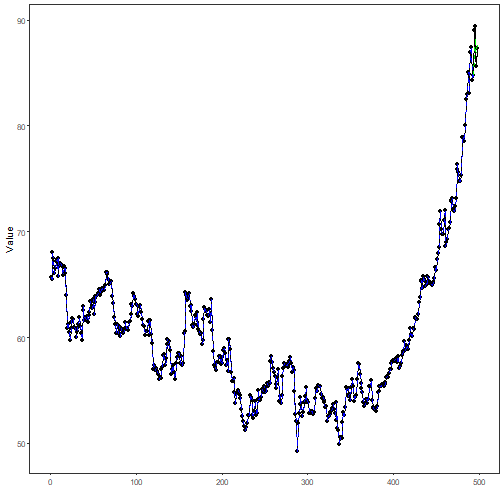

## Stock Closing-Price Forecasting with Conv1D as Target Learner

About the method
- This example keeps the same stock-closing-price scenario, but now the target `close` is forecast with `ts_conv1d()`.

Didactic goal: inspect how a 1D convolutional network behaves as the target learner inside the target-centered multivariate workflow.


``` r
source(url("https://raw.githubusercontent.com/cefet-rj-dal/tspredit/main/examples/seed.R"))
# Stock closing-price forecasting with Conv1D as target learner

# Installing packages (if needed)
# install.packages("tspredit")
```


``` r
library(daltoolbox)
library(daltoolboxdp)
library(tspredit)
```


``` r
data(stocks)

if (!is.null(attr(stocks, "url"))) {
  stocks <- loadfulldata(stocks)
}

ticker_name <- if ("VALE3" %in% names(stocks)) "VALE3" else names(stocks)[1]
ticker <- stocks[[ticker_name]]
ticker <- ticker[, c("date", "open", "high", "low", "close", "volume")]
ticker <- stats::na.omit(ticker)
ticker <- subset(ticker, open > 0 & high > 0 & low > 0 & volume > 0)
cutoff_date <- max(ticker$date) - 365 * 2
ticker <- ticker[ticker$date > cutoff_date, ]

mv <- ts_data_mv(
  ticker[, c("open", "high", "low", "close", "volume")],
  y = "close",
  x = c("open", "high", "low", "volume")
)

samp <- ts_sample(mv, test_size = 5)
output <- tail(samp$test$close, 5)
```


``` r
model <- ts_regsw_mv(
  model_y = ts_mv_spec(
    ts_conv1d(ts_norm_gminmax(), input_size = 4, epochs = 250),
    variables = c("close", "open", "high", "low")
  ),
  models_x = list(
    open = ts_mv_spec(
      ts_conv1d(ts_norm_gminmax(), input_size = 3, epochs = 250),
      variables = c("open", "close", "high")
    ),
    high = ts_mv_spec(
      ts_conv1d(ts_norm_gminmax(), input_size = 3, epochs = 250),
      variables = c("high", "close", "open")
    ),
    low = ts_mv_spec(
      ts_conv1d(ts_norm_gminmax(), input_size = 3, epochs = 250),
      variables = c("low", "close", "open")
    ),
    volume = ts_mv_spec(
      ts_conv1d(ts_norm_gminmax(), input_size = 3, epochs = 250),
      variables = c("volume", "close", "open")
    )
  ),
  window_size = 5
)
```


``` r
set_example_seed()
model <- fit(model, samp$train)
pred_1 <- predict(model, steps_ahead = 1)
pred_1
```

```
## [1] 86.93155
## attr(,"y_name")
## [1] "close"
## attr(,"x_names")
## [1] "open"   "high"   "low"    "volume"
## attr(,"variables")
## [1] "close"  "open"   "high"   "low"    "volume"
## attr(,"steps_ahead")
## [1] 1
## attr(,"prediction_x")
## attr(,"prediction_x")$open
## [1] 86.41652
## 
## attr(,"prediction_x")$high
## [1] 88.1903
## 
## attr(,"prediction_x")$low
## [1] 85.92412
## 
## attr(,"prediction_x")$volume
## [1] 23869468
## 
## attr(,"system")
##      close     open    high      low   volume
## 1 86.93155 86.41652 88.1903 85.92412 23869468
## attr(,"class")
## [1] "ts_mv_prediction" "numeric"
```


``` r
pred_5 <- predict(model, steps_ahead = 5)
pred_5
```

```
## [1] 86.93155 88.30705 87.15776 86.84569 87.68368
## attr(,"y_name")
## [1] "close"
## attr(,"x_names")
## [1] "open"   "high"   "low"    "volume"
## attr(,"variables")
## [1] "close"  "open"   "high"   "low"    "volume"
## attr(,"steps_ahead")
## [1] 5
## attr(,"prediction_x")
## attr(,"prediction_x")$open
## [1] 86.41652 86.99760 86.71514 87.02335 87.47252
## 
## attr(,"prediction_x")$high
## [1] 88.19030 90.34180 90.20884 89.02739 89.35281
## 
## attr(,"prediction_x")$low
## [1] 85.92412 87.26067 86.08586 85.97330 86.89727
## 
## attr(,"prediction_x")$volume
## [1] 23869468 27413616 25371078 26897153 29788440
## 
## attr(,"system")
##      close     open     high      low   volume
## 1 86.93155 86.41652 88.19030 85.92412 23869468
## 2 88.30705 86.99760 90.34180 87.26067 27413616
## 3 87.15776 86.71514 90.20884 86.08586 25371078
## 4 86.84569 87.02335 89.02739 85.97330 26897153
## 5 87.68368 87.47252 89.35281 86.89727 29788440
## attr(,"class")
## [1] "ts_mv_prediction" "numeric"
```


``` r
attr(pred_5, "system")
```

```
##      close     open     high      low   volume
## 1 86.93155 86.41652 88.19030 85.92412 23869468
## 2 88.30705 86.99760 90.34180 87.26067 27413616
## 3 87.15776 86.71514 90.20884 86.08586 25371078
## 4 86.84569 87.02335 89.02739 85.97330 26897153
## 5 87.68368 87.47252 89.35281 86.89727 29788440
```


``` r
ev_test <- evaluate(model, output, pred_5)
ev_test$metrics
```

```
##        mse      smape        R2
## 1 1.523342 0.01251189 0.2788089
```


``` r
plot_ts_pred_mv(samp$train, samp$test, pred_5, variable = "close")
```



What this example shows
- `ts_conv1d()` can be reused directly as the target learner inside `ts_regsw_mv()`.
- The same learner family can be reused for the target and for all endogenous auxiliaries when the goal is a cleaner didactic comparison.
