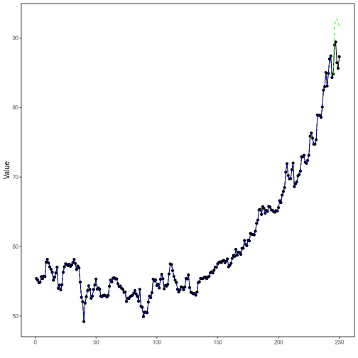

## Stock Closing-Price Forecasting with PyTorch MLP as Target Learner

About the method
- This example keeps the same stock-closing-price scenario, but now the target `close` is forecast with `torch_ts_mlp()`.

Didactic goal: inspect how a PyTorch-based feedforward MLP behaves as the target learner inside the target-centered multivariate workflow.


``` r
source(url("https://raw.githubusercontent.com/cefet-rj-dal/tspredit/main/examples/seed.R"))
# Stock closing-price forecasting with PyTorch MLP as target learner

# Installing packages (if needed)
# install.packages("tspredit")
```


``` r
library(daltoolbox)
library(daltoolboxdp)
library(tspredit)
```


``` r
data(stocks)

if (!is.null(attr(stocks, "url"))) {
  stocks <- loadfulldata(stocks)
}

ticker_name <- if ("VALE3" %in% names(stocks)) "VALE3" else names(stocks)[1]
ticker <- stocks[[ticker_name]]
ticker <- ticker[, c("date", "open", "high", "low", "close", "volume")]
ticker <- stats::na.omit(ticker)
ticker <- subset(ticker, open > 0 & high > 0 & low > 0 & volume > 0)
cutoff_date <- max(ticker$date) - 365
ticker <- ticker[ticker$date > cutoff_date, ]

mv <- ts_data_mv(
  ticker[, c("open", "high", "low", "close", "volume")],
  y = "close",
  x = c("open", "high", "low", "volume")
)

samp <- ts_sample(mv, test_size = 5)
output <- tail(samp$test$close, 5)
```


``` r
model <- ts_regsw_mv(
  model_y = ts_mv_spec(
    torch_ts_mlp(
      ts_norm_gminmax(),
      input_size = 4,
      hidden_sizes = c(8L, 4L),
      epochs = 10L,
      batch_size = 16L
    ),
    variables = c("close", "open", "high", "low")
  ),
  models_x = list(
    open = ts_mv_spec(
      torch_ts_mlp(
        ts_norm_gminmax(),
        input_size = 3,
        hidden_sizes = c(8L, 4L),
        epochs = 10L,
        batch_size = 16L
      ),
      variables = c("open", "close", "high")
    ),
    high = ts_mv_spec(
      torch_ts_mlp(
        ts_norm_gminmax(),
        input_size = 3,
        hidden_sizes = c(8L, 4L),
        epochs = 10L,
        batch_size = 16L
      ),
      variables = c("high", "close", "open")
    ),
    low = ts_mv_spec(
      torch_ts_mlp(
        ts_norm_gminmax(),
        input_size = 3,
        hidden_sizes = c(8L, 4L),
        epochs = 10L,
        batch_size = 16L
      ),
      variables = c("low", "close", "open")
    ),
    volume = ts_mv_spec(
      torch_ts_mlp(
        ts_norm_gminmax(),
        input_size = 3,
        hidden_sizes = c(8L, 4L),
        epochs = 10L,
        batch_size = 16L
      ),
      variables = c("volume", "close", "open")
    )
  ),
  window_size = 5
)
```


``` r
set_example_seed()
model <- fit(model, samp$train)
pred_1 <- predict(model, steps_ahead = 1)
pred_1
```

```
## [1] 91.79826
## attr(,"y_name")
## [1] "close"
## attr(,"x_names")
## [1] "open"   "high"   "low"    "volume"
## attr(,"variables")
## [1] "close"  "open"   "high"   "low"    "volume"
## attr(,"steps_ahead")
## [1] 1
## attr(,"prediction_x")
## attr(,"prediction_x")$open
## [1] 86.36187
## 
## attr(,"prediction_x")$high
## [1] 59.70926
## 
## attr(,"prediction_x")$low
## [1] 91.04939
## 
## attr(,"prediction_x")$volume
## [1] 8052113
## 
## attr(,"system")
##      close     open     high      low  volume
## 1 91.79826 86.36187 59.70926 91.04939 8052113
## attr(,"class")
## [1] "ts_mv_prediction" "numeric"
```


``` r
pred_5 <- predict(model, steps_ahead = 5)
pred_5
```

```
## [1] 91.79826 92.46502 92.77448 92.28625 91.56537
## attr(,"y_name")
## [1] "close"
## attr(,"x_names")
## [1] "open"   "high"   "low"    "volume"
## attr(,"variables")
## [1] "close"  "open"   "high"   "low"    "volume"
## attr(,"steps_ahead")
## [1] 5
## attr(,"prediction_x")
## attr(,"prediction_x")$open
## [1] 86.36187 83.36290 81.77297 79.16950 78.12038
## 
## attr(,"prediction_x")$high
## [1] 59.70926 59.70926 59.12735 59.39346 59.28188
## 
## attr(,"prediction_x")$low
## [1] 91.04939 93.70523 94.55964 94.32892 95.33301
## 
## attr(,"prediction_x")$volume
## [1]  8052112.8  4607293.5  2586505.4   284254.1 -1927496.3
## 
## attr(,"system")
##      close     open     high      low     volume
## 1 91.79826 86.36187 59.70926 91.04939  8052112.8
## 2 92.46502 83.36290 59.70926 93.70523  4607293.5
## 3 92.77448 81.77297 59.12735 94.55964  2586505.4
## 4 92.28625 79.16950 59.39346 94.32892   284254.1
## 5 91.56537 78.12038 59.28188 95.33301 -1927496.3
## attr(,"class")
## [1] "ts_mv_prediction" "numeric"
```


``` r
attr(pred_5, "system")
```

```
##      close     open     high      low     volume
## 1 91.79826 86.36187 59.70926 91.04939  8052112.8
## 2 92.46502 83.36290 59.70926 93.70523  4607293.5
## 3 92.77448 81.77297 59.12735 94.55964  2586505.4
## 4 92.28625 79.16950 59.39346 94.32892   284254.1
## 5 91.56537 78.12038 59.28188 95.33301 -1927496.3
```


``` r
ev_test <- evaluate(model, output, pred_5)
ev_test$metrics
```

```
##        mse      smape       R2
## 1 23.90212 0.05148355 -10.3159
```


``` r
plot_ts_pred_mv(samp$train, samp$test, pred_5, variable = "close")
```



What this example shows
- `torch_ts_mlp()` can be reused directly as the target learner inside `ts_regsw_mv()`.
- The same PyTorch learner family can be reused for the target and for all endogenous auxiliaries when the goal is a cleaner didactic comparison.
