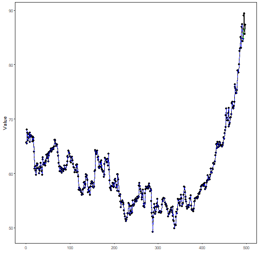

## Stock Closing-Price Forecasting with LSTM as Target Learner

About the method
- This example keeps the same stock-closing-price scenario, but now the target `close` is forecast with `ts_lstm()`.

Didactic goal: inspect how an LSTM behaves as the target learner inside the target-centered multivariate workflow.


``` r
source(url("https://raw.githubusercontent.com/cefet-rj-dal/tspredit/main/examples/seed.R"))
# Stock closing-price forecasting with LSTM as target learner

# Installing packages (if needed)
# install.packages("tspredit")
```


``` r
library(daltoolbox)
library(daltoolboxdp)
library(tspredit)
```


``` r
data(stocks)

if (!is.null(attr(stocks, "url"))) {
  stocks <- loadfulldata(stocks)
}

ticker_name <- if ("VALE3" %in% names(stocks)) "VALE3" else names(stocks)[1]
ticker <- stocks[[ticker_name]]
ticker <- ticker[, c("date", "open", "high", "low", "close", "volume")]
ticker <- stats::na.omit(ticker)
ticker <- subset(ticker, open > 0 & high > 0 & low > 0 & volume > 0)
cutoff_date <- max(ticker$date) - 365 * 2
ticker <- ticker[ticker$date > cutoff_date, ]

mv <- ts_data_mv(
  ticker[, c("open", "high", "low", "close", "volume")],
  y = "close",
  x = c("open", "high", "low", "volume")
)

samp <- ts_sample(mv, test_size = 5)
output <- tail(samp$test$close, 5)
```


``` r
model <- ts_regsw_mv(
  model_y = ts_mv_spec(
    ts_lstm(ts_norm_gminmax(), input_size = 4, epochs = 250),
    variables = c("close", "open", "high", "low")
  ),
  models_x = list(
    open = ts_mv_spec(
      ts_lstm(ts_norm_gminmax(), input_size = 3, epochs = 250),
      variables = c("open", "close", "high")
    ),
    high = ts_mv_spec(
      ts_lstm(ts_norm_gminmax(), input_size = 3, epochs = 250),
      variables = c("high", "close", "open")
    ),
    low = ts_mv_spec(
      ts_lstm(ts_norm_gminmax(), input_size = 3, epochs = 250),
      variables = c("low", "close", "open")
    ),
    volume = ts_mv_spec(
      ts_lstm(ts_norm_gminmax(), input_size = 3, epochs = 250),
      variables = c("volume", "close", "open")
    )
  ),
  window_size = 5
)
```


``` r
set_example_seed()
model <- fit(model, samp$train)
pred_1 <- predict(model, steps_ahead = 1)
pred_1
```

```
## [1] 86.41416
## attr(,"y_name")
## [1] "close"
## attr(,"x_names")
## [1] "open"   "high"   "low"    "volume"
## attr(,"variables")
## [1] "close"  "open"   "high"   "low"    "volume"
## attr(,"steps_ahead")
## [1] 1
## attr(,"prediction_x")
## attr(,"prediction_x")$open
## [1] 84.41153
## 
## attr(,"prediction_x")$high
## [1] 87.02788
## 
## attr(,"prediction_x")$low
## [1] 83.73748
## 
## attr(,"prediction_x")$volume
## [1] 26415487
## 
## attr(,"system")
##      close     open     high      low   volume
## 1 86.41416 84.41153 87.02788 83.73748 26415487
## attr(,"class")
## [1] "ts_mv_prediction" "numeric"
```


``` r
pred_5 <- predict(model, steps_ahead = 5)
pred_5
```

```
## [1] 86.41416 86.48505 86.58636 86.54108 86.86637
## attr(,"y_name")
## [1] "close"
## attr(,"x_names")
## [1] "open"   "high"   "low"    "volume"
## attr(,"variables")
## [1] "close"  "open"   "high"   "low"    "volume"
## attr(,"steps_ahead")
## [1] 5
## attr(,"prediction_x")
## attr(,"prediction_x")$open
## [1] 84.41153 85.60246 85.90024 86.21747 86.05999
## 
## attr(,"prediction_x")$high
## [1] 87.02788 87.91188 88.21417 88.53108 88.23939
## 
## attr(,"prediction_x")$low
## [1] 83.73748 84.69236 84.84473 85.03292 84.86118
## 
## attr(,"prediction_x")$volume
## [1] 26415487 27978770 27020160 26354099 26596411
## 
## attr(,"system")
##      close     open     high      low   volume
## 1 86.41416 84.41153 87.02788 83.73748 26415487
## 2 86.48505 85.60246 87.91188 84.69236 27978770
## 3 86.58636 85.90024 88.21417 84.84473 27020160
## 4 86.54108 86.21747 88.53108 85.03292 26354099
## 5 86.86637 86.05999 88.23939 84.86118 26596411
## attr(,"class")
## [1] "ts_mv_prediction" "numeric"
```


``` r
attr(pred_5, "system")
```

```
##      close     open     high      low   volume
## 1 86.41416 84.41153 87.02788 83.73748 26415487
## 2 86.48505 85.60246 87.91188 84.69236 27978770
## 3 86.58636 85.90024 88.21417 84.84473 27020160
## 4 86.54108 86.21747 88.53108 85.03292 26354099
## 5 86.86637 86.05999 88.23939 84.86118 26596411
```


``` r
ev_test <- evaluate(model, output, pred_5)
ev_test$metrics
```

```
##        mse      smape         R2
## 1 3.270633 0.01602108 -0.5484057
```


``` r
plot_ts_pred_mv(samp$train, samp$test, pred_5, variable = "close")
```



What this example shows
- `ts_lstm()` can be reused directly as the target learner inside `ts_regsw_mv()`.
- The same learner family can be reused for the target and for all endogenous auxiliaries when the goal is a cleaner didactic comparison.
