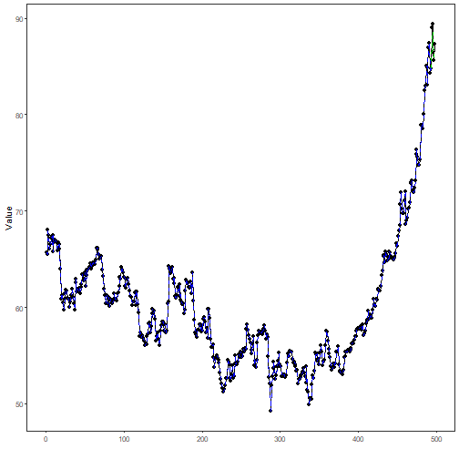

## Stock Closing-Price Forecasting with Singular Multivariate Linear Regression

About the method
- This example starts a second stock-model battery, now in the singular multivariate branch.
- The target remains `close`, but the model is `ts_lm_mv()` over aligned observations with `sw = 1`.

Didactic goal: inspect how the singular multivariate branch behaves on the same stock scenario used in the sliding-window battery.


``` r
source(url("https://raw.githubusercontent.com/cefet-rj-dal/tspredit/main/examples/seed.R"))
# Stock closing-price forecasting with singular multivariate linear regression

# Installing packages (if needed)
# install.packages("tspredit")
```


``` r
library(daltoolbox)
library(tspredit)
```

We keep the same stock scenario used in the sliding-window battery, including
the same two-year recorte and the same target-centered definition of the
variables.


``` r
data(stocks)

if (!is.null(attr(stocks, "url"))) {
  stocks <- loadfulldata(stocks)
}

ticker_name <- if ("VALE3" %in% names(stocks)) "VALE3" else names(stocks)[1]
ticker <- stocks[[ticker_name]]
ticker <- ticker[, c("date", "open", "high", "low", "close", "volume")]
ticker <- stats::na.omit(ticker)
ticker <- subset(ticker, open > 0 & high > 0 & low > 0 & volume > 0)
cutoff_date <- max(ticker$date) - 365 * 2
ticker <- ticker[ticker$date > cutoff_date, ]

mv <- ts_data_mv(
  ticker[, c("open", "high", "low", "close", "volume")],
  y = "close",
  x = c("open", "high", "low", "volume")
)

samp <- ts_sample(mv, test_size = 5)
output <- tail(samp$test$close, 5)
```

In the singular linear-regression case, the future auxiliary values are taken
directly from the aligned test rows. This makes the structural relation between
`close` and the auxiliary variables explicit.


``` r
model <- ts_lm_mv(formula = close ~ open + high + low + volume)
model <- fit(model, samp$train)
```


``` r
pred_1 <- predict(model, x = samp$test, steps_ahead = 1)
pred_1
```

```
## [1] 88.34744
## attr(,"y_name")
## [1] "close"
## attr(,"x_names")
## [1] "open"   "high"   "low"    "volume"
## attr(,"variables")
## [1] "close"  "open"   "high"   "low"    "volume"
## attr(,"steps_ahead")
## [1] 1
## attr(,"prediction_x")
## attr(,"prediction_x")$open
## [1] 86.42
## 
## attr(,"prediction_x")$high
## [1] 89
## 
## attr(,"prediction_x")$low
## [1] 86.42
## 
## attr(,"prediction_x")$volume
## [1] 37709700
## 
## attr(,"system")
##      close  open high   low   volume
## 1 88.34744 86.42   89 86.42 37709700
## attr(,"class")
## [1] "ts_mv_prediction" "numeric"
```


``` r
pred_5 <- predict(model, x = samp$test, steps_ahead = 5)
pred_5
```

```
## [1] 88.34744 88.54710 87.22328 86.23007 85.64975
## attr(,"y_name")
## [1] "close"
## attr(,"x_names")
## [1] "open"   "high"   "low"    "volume"
## attr(,"variables")
## [1] "close"  "open"   "high"   "low"    "volume"
## attr(,"steps_ahead")
## [1] 5
## attr(,"prediction_x")
## attr(,"prediction_x")$open
## [1] 86.42 88.51 87.99 86.41 86.65
## 
## attr(,"prediction_x")$high
## [1] 89.00 89.59 88.93 87.56 87.68
## 
## attr(,"prediction_x")$low
## [1] 86.42 87.55 86.24 85.20 84.63
## 
## attr(,"prediction_x")$volume
## [1] 37709700 51744400 57049000 28889600 26531100
## 
## attr(,"system")
##      close  open  high   low   volume
## 1 88.34744 86.42 89.00 86.42 37709700
## 2 88.54710 88.51 89.59 87.55 51744400
## 3 87.22328 87.99 88.93 86.24 57049000
## 4 86.23007 86.41 87.56 85.20 28889600
## 5 85.64975 86.65 87.68 84.63 26531100
## attr(,"class")
## [1] "ts_mv_prediction" "numeric"
```


``` r
attr(pred_5, "system")
```

```
##      close  open  high   low   volume
## 1 88.34744 86.42 89.00 86.42 37709700
## 2 88.54710 88.51 89.59 87.55 51744400
## 3 87.22328 87.99 88.93 86.24 57049000
## 4 86.23007 86.41 87.56 85.20 28889600
## 5 85.64975 86.65 87.68 84.63 26531100
```


``` r
ev_test <- evaluate(model, output, pred_5)
ev_test$metrics
```

```
##         mse      smape        R2
## 1 0.9813773 0.01045094 0.5353897
```


``` r
plot_ts_pred_mv(samp$train, samp$test, pred_5, variable = "close")
```



What this example shows
- `ts_lm_mv()` can be applied to the same stock scenario as the sliding-window battery, but in the aligned singular branch.
- The linear-regression formulation makes the relation between `close` and the auxiliaries explicit through a formula.
- In this singular case, the future auxiliary values are supplied directly from the held-out aligned observations.
