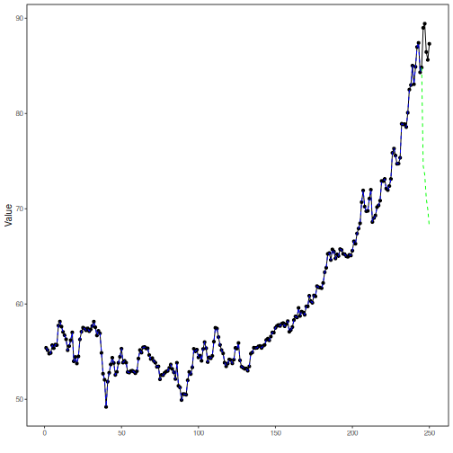

## Stock Closing-Price Forecasting with LSTM as Target Learner

About the method
- This example keeps the same stock-closing-price scenario, but now the target `close` is forecast with `ts_lstm()`.

Didactic goal: inspect how an LSTM behaves as the target learner inside the target-centered multivariate workflow.


``` r
source(url("https://raw.githubusercontent.com/cefet-rj-dal/tspredit/main/examples/seed.R"))
# Stock closing-price forecasting with LSTM as target learner

# Installing packages (if needed)
# install.packages("tspredit")
```


``` r
library(daltoolbox)
library(daltoolboxdp)
library(tspredit)
```


``` r
data(stocks)

if (!is.null(attr(stocks, "url"))) {
  stocks <- loadfulldata(stocks)
}

ticker_name <- if ("VALE3" %in% names(stocks)) "VALE3" else names(stocks)[1]
ticker <- stocks[[ticker_name]]
ticker <- ticker[, c("date", "open", "high", "low", "close", "volume")]
ticker <- stats::na.omit(ticker)
ticker <- subset(ticker, open > 0 & high > 0 & low > 0 & volume > 0)
cutoff_date <- max(ticker$date) - 365
ticker <- ticker[ticker$date > cutoff_date, ]

mv <- ts_data_mv(
  ticker[, c("open", "high", "low", "close", "volume")],
  y = "close",
  x = c("open", "high", "low", "volume")
)

samp <- ts_sample(mv, test_size = 5)
output <- tail(samp$test$close, 5)
```


``` r
model <- ts_regsw_mv(
  model_y = ts_mv_spec(
    ts_lstm(ts_norm_gminmax(), input_size = 4, epochs = 10),
    variables = c("close", "open", "high", "low")
  ),
  models_x = list(
    open = ts_mv_spec(
      ts_lstm(ts_norm_gminmax(), input_size = 3, epochs = 10),
      variables = c("open", "close", "high")
    ),
    high = ts_mv_spec(
      ts_lstm(ts_norm_gminmax(), input_size = 3, epochs = 10),
      variables = c("high", "close", "open")
    ),
    low = ts_mv_spec(
      ts_lstm(ts_norm_gminmax(), input_size = 3, epochs = 10),
      variables = c("low", "close", "open")
    ),
    volume = ts_mv_spec(
      ts_lstm(ts_norm_gminmax(), input_size = 3, epochs = 10),
      variables = c("volume", "close", "open")
    )
  ),
  window_size = 5
)
```


``` r
set_example_seed()
model <- fit(model, samp$train)
pred_1 <- predict(model, steps_ahead = 1)
pred_1
```

```
## [1] 74.49945
## attr(,"y_name")
## [1] "close"
## attr(,"x_names")
## [1] "open"   "high"   "low"    "volume"
## attr(,"variables")
## [1] "close"  "open"   "high"   "low"    "volume"
## attr(,"steps_ahead")
## [1] 1
## attr(,"prediction_x")
## attr(,"prediction_x")$open
## [1] 67.13963
## 
## attr(,"prediction_x")$high
## [1] 67.86568
## 
## attr(,"prediction_x")$low
## [1] 67.06579
## 
## attr(,"prediction_x")$volume
## [1] 23279582
## 
## attr(,"system")
##      close     open     high      low   volume
## 1 74.49945 67.13963 67.86568 67.06579 23279582
## attr(,"class")
## [1] "ts_mv_prediction" "numeric"
```


``` r
pred_5 <- predict(model, steps_ahead = 5)
pred_5
```

```
## [1] 74.49945 73.57839 71.07178 69.89866 68.04407
## attr(,"y_name")
## [1] "close"
## attr(,"x_names")
## [1] "open"   "high"   "low"    "volume"
## attr(,"variables")
## [1] "close"  "open"   "high"   "low"    "volume"
## attr(,"steps_ahead")
## [1] 5
## attr(,"prediction_x")
## attr(,"prediction_x")$open
## [1] 67.13963 67.70869 66.18852 64.68146 63.51158
## 
## attr(,"prediction_x")$high
## [1] 67.86568 67.95505 65.77859 66.50023 65.21687
## 
## attr(,"prediction_x")$low
## [1] 67.06579 66.91909 67.35801 66.82296 66.66029
## 
## attr(,"prediction_x")$volume
## [1] 23279582 24004668 23914339 23421982 23079636
## 
## attr(,"system")
##      close     open     high      low   volume
## 1 74.49945 67.13963 67.86568 67.06579 23279582
## 2 73.57839 67.70869 67.95505 66.91909 24004668
## 3 71.07178 66.18852 65.77859 67.35801 23914339
## 4 69.89866 64.68146 66.50023 66.82296 23421982
## 5 68.04407 63.51158 65.21687 66.66029 23079636
## attr(,"class")
## [1] "ts_mv_prediction" "numeric"
```


``` r
attr(pred_5, "system")
```

```
##      close     open     high      low   volume
## 1 74.49945 67.13963 67.86568 67.06579 23279582
## 2 73.57839 67.70869 67.95505 66.91909 24004668
## 3 71.07178 66.18852 65.77859 67.35801 23914339
## 4 69.89866 64.68146 66.50023 66.82296 23421982
## 5 68.04407 63.51158 65.21687 66.66029 23079636
```


``` r
ev_test <- evaluate(model, output, pred_5)
ev_test$metrics
```

```
##       mse     smape        R2
## 1 263.278 0.2034654 -123.6429
```


``` r
plot_ts_pred_mv(samp$train, samp$test, pred_5, variable = "close")
```



What this example shows
- `ts_lstm()` can be reused directly as the target learner inside `ts_regsw_mv()`.
- The same learner family can be reused for the target and for all endogenous auxiliaries when the goal is a cleaner didactic comparison.
