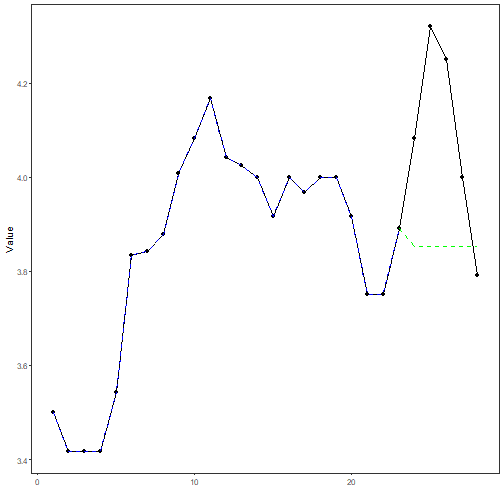

## Stock Closing-Price Forecasting with Singular ARIMAX

About the method
- This example keeps the same stock scenario, but now the target `close` is forecast with `ts_arimax()`.
- The auxiliary paths are generated by their own univariate support models inside the singular multivariate branch.

Didactic goal: inspect how the raw-series ARIMA branch extends to the aligned stock scenario without moving into sliding windows.


``` r
source(url("https://raw.githubusercontent.com/cefet-rj-dal/tspredit/main/examples/seed.R"))
# Stock closing-price forecasting with singular ARIMAX

# Installing packages (if needed)
# install.packages("tspredit")
```


``` r
library(daltoolbox)
library(tspredit)
```


``` r
data(stocks)

if (!is.null(attr(stocks, "url"))) {
  stocks <- loadfulldata(stocks)
}
```

```
## Warning in .rs.downloadFile(url = url, destfile = tf, quiet = TRUE, mode = "wb"): downloaded length 1742821 != reported length 3229450
```

```
## Warning in .rs.downloadFile(url = url, destfile = tf, quiet = TRUE, mode = "wb"): URL
## 'https://raw.githubusercontent.com/cefet-rj-dal/tspredbench/refs/heads/main/tspredit/stocks.RData': Timeout of 60 seconds was reached
```

```
## Error in `.rs.downloadFile()`:
## ! download from 'https://raw.githubusercontent.com/cefet-rj-dal/tspredbench/refs/heads/main/tspredit/stocks.RData' failed
```

``` r
ticker_name <- if ("VALE3" %in% names(stocks)) "VALE3" else names(stocks)[1]
ticker <- stocks[[ticker_name]]
ticker <- ticker[, c("date", "open", "high", "low", "close", "volume")]
ticker <- stats::na.omit(ticker)
ticker <- subset(ticker, open > 0 & high > 0 & low > 0 & volume > 0)
cutoff_date <- max(ticker$date) - 365 * 2
ticker <- ticker[ticker$date > cutoff_date, ]

mv <- ts_data_mv(
  ticker[, c("open", "high", "low", "close", "volume")],
  y = "close",
  x = c("open", "high", "low", "volume")
)

samp <- ts_sample(mv, test_size = 5)
output <- tail(samp$test$close, 5)
```

The target is learned with `ARIMAX`, while the singular branch projects the
future auxiliary values through univariate `ARIMA` support models.


``` r
model <- ts_arimax(
  models_x = list(
    open = ts_arima(),
    high = ts_arima(),
    low = ts_arima(),
    volume = ts_arima()
  )
)

model <- fit(model, samp$train)
```


``` r
pred_1 <- predict(model, steps_ahead = 1)
pred_1
```

```
## [1] 3.853311
## attr(,"y_name")
## [1] "close"
## attr(,"x_names")
## [1] "open"   "high"   "low"    "volume"
## attr(,"variables")
## [1] "close"  "open"   "high"   "low"    "volume"
## attr(,"steps_ahead")
## [1] 1
## attr(,"prediction_x")
## attr(,"prediction_x")$open
## [1] 3.75
## 
## attr(,"prediction_x")$high
## [1] 3.891666
## 
## attr(,"prediction_x")$low
## [1] 3.75
## 
## attr(,"prediction_x")$volume
## [1] 1543513
## 
## attr(,"system")
##      close open     high  low  volume
## 1 3.853311 3.75 3.891666 3.75 1543513
## attr(,"class")
## [1] "ts_mv_prediction" "numeric"
```


``` r
pred_5 <- predict(model, steps_ahead = 5)
pred_5
```

```
## [1] 3.853311 3.853311 3.853311 3.853311 3.853311
## attr(,"y_name")
## [1] "close"
## attr(,"x_names")
## [1] "open"   "high"   "low"    "volume"
## attr(,"variables")
## [1] "close"  "open"   "high"   "low"    "volume"
## attr(,"steps_ahead")
## [1] 5
## attr(,"prediction_x")
## attr(,"prediction_x")$open
## [1] 3.75 3.75 3.75 3.75 3.75
## 
## attr(,"prediction_x")$high
## [1] 3.891666 3.891666 3.891666 3.891666 3.891666
## 
## attr(,"prediction_x")$low
## [1] 3.75 3.75 3.75 3.75 3.75
## 
## attr(,"prediction_x")$volume
## [1] 1543513 1543513 1543513 1543513 1543513
## 
## attr(,"system")
##      close open     high  low  volume
## 1 3.853311 3.75 3.891666 3.75 1543513
## 2 3.853311 3.75 3.891666 3.75 1543513
## 3 3.853311 3.75 3.891666 3.75 1543513
## 4 3.853311 3.75 3.891666 3.75 1543513
## 5 3.853311 3.75 3.891666 3.75 1543513
## attr(,"class")
## [1] "ts_mv_prediction" "numeric"
```


``` r
attr(pred_5, "system")
```

```
##      close open     high  low  volume
## 1 3.853311 3.75 3.891666 3.75 1543513
## 2 3.853311 3.75 3.891666 3.75 1543513
## 3 3.853311 3.75 3.891666 3.75 1543513
## 4 3.853311 3.75 3.891666 3.75 1543513
## 5 3.853311 3.75 3.891666 3.75 1543513
```


``` r
ev_test <- evaluate(model, output, pred_5)
ev_test$metrics
```

```
##          mse     smape        R2
## 1 0.09085392 0.0647933 -1.573411
```


``` r
plot_ts_pred_mv(samp$train, samp$test, pred_5, variable = "close")
```



What this example shows
- `ts_arimax()` extends the singular ARIMA branch to the same stock scenario used in the sliding-window battery.
- The target remains `close`, but the forecast horizon also requires projected auxiliary trajectories.
- Those auxiliary paths can be supplied by their own univariate `ARIMA` models in the singular branch.
