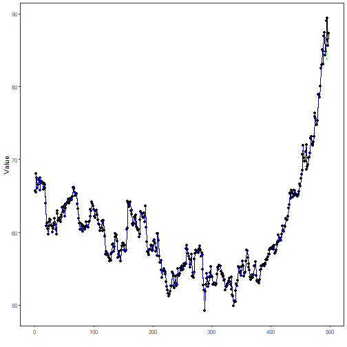

## Stock Closing-Price Forecasting with Singular Vector Autoregression

About the method
- This example closes the singular stock battery with `ts_var()`.
- The whole aligned system is modeled jointly, but `close` remains the distinguished target returned by `predict()`.

Didactic goal: inspect how a systemic singular model behaves on the same stock scenario used in the sliding-window battery.


``` r
source(url("https://raw.githubusercontent.com/cefet-rj-dal/tspredit/main/examples/seed.R"))
# Stock closing-price forecasting with singular vector autoregression

# Installing packages (if needed)
# install.packages("tspredit")
```


``` r
library(daltoolbox)
library(tspredit)
```


``` r
data(stocks)

if (!is.null(attr(stocks, "url"))) {
  stocks <- loadfulldata(stocks)
}

ticker_name <- if ("VALE3" %in% names(stocks)) "VALE3" else names(stocks)[1]
ticker <- stocks[[ticker_name]]
ticker <- ticker[, c("date", "open", "high", "low", "close", "volume")]
ticker <- stats::na.omit(ticker)
ticker <- subset(ticker, open > 0 & high > 0 & low > 0 & volume > 0)
cutoff_date <- max(ticker$date) - 365 * 2
ticker <- ticker[ticker$date > cutoff_date, ]

mv <- ts_data_mv(
  ticker[, c("open", "high", "low", "close", "volume")],
  y = "close",
  x = c("open", "high", "low", "volume")
)

samp <- ts_sample(mv, test_size = 5)
output <- tail(samp$test$close, 5)
```

The vector autoregression works directly on the aligned multivariate system and
returns the target path together with the synchronized system forecast.


``` r
model <- ts_var(p_max = 3)
model <- fit(model, samp$train)
```


``` r
pred_1 <- predict(model, steps_ahead = 1)
pred_1
```

```
## [1] 84.15722
## attr(,"y_name")
## [1] "close"
## attr(,"x_names")
## [1] "open"   "high"   "low"    "volume"
## attr(,"variables")
## [1] "close"  "open"   "high"   "low"    "volume"
## attr(,"steps_ahead")
## [1] 1
## attr(,"prediction_x")
## attr(,"prediction_x")$open
## [1] 84.40253
## 
## attr(,"prediction_x")$high
## [1] 85.6386
## 
## attr(,"prediction_x")$low
## [1] 83.31439
## 
## attr(,"prediction_x")$volume
## [1] 22295395
## 
## attr(,"system")
##      close     open    high      low   volume
## 1 84.15722 84.40253 85.6386 83.31439 22295395
## attr(,"class")
## [1] "ts_mv_prediction" "numeric"
```


``` r
pred_5 <- predict(model, steps_ahead = 5)
pred_5
```

```
## [1] 84.15722 83.65722 83.55771 83.47442 83.44886
## attr(,"y_name")
## [1] "close"
## attr(,"x_names")
## [1] "open"   "high"   "low"    "volume"
## attr(,"variables")
## [1] "close"  "open"   "high"   "low"    "volume"
## attr(,"steps_ahead")
## [1] 5
## attr(,"prediction_x")
## attr(,"prediction_x")$open
## [1] 84.40253 83.69493 83.41592 83.30848 83.25165
## 
## attr(,"prediction_x")$high
## [1] 85.63860 85.07280 84.63328 84.55237 84.47928
## 
## attr(,"prediction_x")$low
## [1] 83.31439 82.69821 82.58174 82.51848 82.48727
## 
## attr(,"prediction_x")$volume
## [1] 22295395 24436690 26197759 27296923 27577709
## 
## attr(,"system")
##      close     open     high      low   volume
## 1 84.15722 84.40253 85.63860 83.31439 22295395
## 2 83.65722 83.69493 85.07280 82.69821 24436690
## 3 83.55771 83.41592 84.63328 82.58174 26197759
## 4 83.47442 83.30848 84.55237 82.51848 27296923
## 5 83.44886 83.25165 84.47928 82.48727 27577709
## attr(,"class")
## [1] "ts_mv_prediction" "numeric"
```


``` r
attr(pred_5, "system")
```

```
##      close     open     high      low   volume
## 1 84.15722 84.40253 85.63860 83.31439 22295395
## 2 83.65722 83.69493 85.07280 82.69821 24436690
## 3 83.55771 83.41592 84.63328 82.58174 26197759
## 4 83.47442 83.30848 84.55237 82.51848 27296923
## 5 83.44886 83.25165 84.47928 82.48727 27577709
```


``` r
ev_test <- evaluate(model, output, pred_5)
ev_test$metrics
```

```
##       mse      smape        R2
## 1 16.9202 0.04545384 -7.010475
```


``` r
plot_ts_pred_mv(samp$train, samp$test, pred_5, variable = "close")
```



What this example shows
- `ts_var()` models the aligned stock system jointly in the singular multivariate branch.
- Even in this systemic setting, the package keeps `close` as the semantic target returned by `predict()`.
- The full system forecast remains available through the multivariate prediction attributes.
