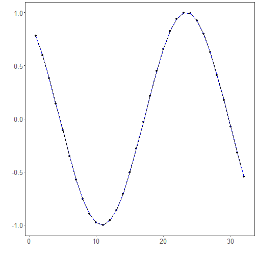

## No Normalization

About the technique

- `ts_norm_none()` leaves the numerical scale unchanged.
- Its role is to establish whether a predictor already works well on the raw scale before introducing transformations.

Didactic goal: use the raw series as the baseline for judging later normalization strategies.


``` r
source(url("https://raw.githubusercontent.com/cefet-rj-dal/tspredit/main/examples/seed.R"))
# No normalization

# Installing the package (if needed)
#install.packages("tspredit")
```

We start by loading the packages used throughout this example.


``` r
library(daltoolbox)
library(tspredit)
library(ggplot2)
```

We load the example series that will be used throughout the demonstration.


``` r
data(tsd)
```

The first plot shows the original series. This is the common visual reference
for all normalization examples in this folder.


``` r
plot_ts(x = tsd$x, y = tsd$y) + theme(text = element_text(size = 16))
```


The next step organizes the series into sliding windows, which is the tabular
representation used by the later transformations and models.


``` r
sw_size <- 10
ts <- ts_data(tsd$y, sw_size)
ts_head(ts, 3)
```

```
##             t9        t8        t7        t6        t5        t4        t3
## [1,] 0.0000000 0.2474040 0.4794255 0.6816388 0.8414710 0.9489846 0.9974950
## [2,] 0.2474040 0.4794255 0.6816388 0.8414710 0.9489846 0.9974950 0.9839859
## [3,] 0.4794255 0.6816388 0.8414710 0.9489846 0.9974950 0.9839859 0.9092974
##             t2        t1        t0
## [1,] 0.9839859 0.9092974 0.7780732
## [2,] 0.9092974 0.7780732 0.5984721
## [3,] 0.7780732 0.5984721 0.3816610
```

``` r
summary(ts[, 10])
```

```
##        t0          
##  Min.   :-0.99929  
##  1st Qu.:-0.55091  
##  Median : 0.05397  
##  Mean   : 0.02988  
##  3rd Qu.: 0.63279  
##  Max.   : 0.99460
```

We now keep the values unchanged and compare the supervised target column
(`t0`) before and after the transformation.


``` r
preproc <- ts_norm_none()
set_example_seed()
preproc <- fit(preproc, ts)
tst <- transform(preproc, ts)
ts_head(tst, 3)
```

```
##             t9        t8        t7        t6        t5        t4        t3
## [1,] 0.0000000 0.2474040 0.4794255 0.6816388 0.8414710 0.9489846 0.9974950
## [2,] 0.2474040 0.4794255 0.6816388 0.8414710 0.9489846 0.9974950 0.9839859
## [3,] 0.4794255 0.6816388 0.8414710 0.9489846 0.9974950 0.9839859 0.9092974
##             t2        t1        t0
## [1,] 0.9839859 0.9092974 0.7780732
## [2,] 0.9092974 0.7780732 0.5984721
## [3,] 0.7780732 0.5984721 0.3816610
```

``` r
summary(tst[, 10])
```

```
##        t0          
##  Min.   :-0.99929  
##  1st Qu.:-0.55091  
##  Median : 0.05397  
##  Mean   : 0.02988  
##  3rd Qu.: 0.63279  
##  Max.   : 0.99460
```

``` r
compare_t0 <- rbind(
  data.frame(idx = seq_len(nrow(ts)), value = as.vector(ts[, ncol(ts)]), series = "original t0"),
  data.frame(idx = seq_len(nrow(tst)), value = as.vector(tst[, ncol(tst)]), series = "transformed t0")
)

plot_ts_pred(
  x = compare_t0[compare_t0$series == "original t0", "idx"],
  y = compare_t0[compare_t0$series == "original t0", "value"],
  yadj = compare_t0[compare_t0$series == "transformed t0", "value"]
) + theme(text = element_text(size = 16))
```



What to observe

- The two curves should overlap completely.
- This file is the baseline reference for the other normalization examples.

References

- C. M. Bishop (2006). Pattern Recognition and Machine Learning. Springer.
