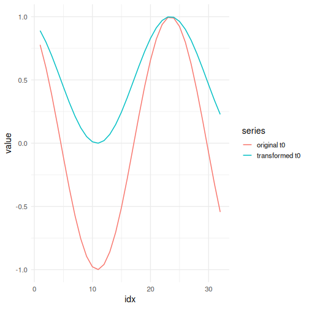

## Global Min-Max Normalization

About the technique

- Global min-max normalization rescales the training values to a fixed interval, usually `[0, 1]`.
- It preserves relative ordering while making magnitudes easier for many learning algorithms to handle.

Didactic goal: inspect the simplest global scaling strategy used in forecasting pipelines.


``` r
source(url("https://raw.githubusercontent.com/cefet-rj-dal/tspredit/main/examples/seed.R"))
# Global Min-Max Normalization

# Installing the package (if needed)
#install.packages("tspredit")
```

We start by loading the packages used throughout this example.


``` r
library(daltoolbox)
library(tspredit)
library(ggplot2)
```

We load the example series that will be used throughout the demonstration.


``` r
data(tsd)
```

The first plot shows the original series. This is the common visual reference
for all normalization examples in this folder.


``` r
plot_ts(x = tsd$x, y = tsd$y) + theme(text = element_text(size = 16))
```


The next step organizes the series into sliding windows, which is the tabular
representation used by the later transformations and models.


``` r
sw_size <- 10
ts <- ts_data(tsd$y, sw_size)
ts_head(ts, 3)
```

```
##             t9        t8        t7        t6        t5        t4        t3        t2        t1        t0
## [1,] 0.0000000 0.2474040 0.4794255 0.6816388 0.8414710 0.9489846 0.9974950 0.9839859 0.9092974 0.7780732
## [2,] 0.2474040 0.4794255 0.6816388 0.8414710 0.9489846 0.9974950 0.9839859 0.9092974 0.7780732 0.5984721
## [3,] 0.4794255 0.6816388 0.8414710 0.9489846 0.9974950 0.9839859 0.9092974 0.7780732 0.5984721 0.3816610
```

``` r
summary(ts[, 10])
```

```
##        t0          
##  Min.   :-0.99929  
##  1st Qu.:-0.55091  
##  Median : 0.05397  
##  Mean   : 0.02988  
##  3rd Qu.: 0.63279  
##  Max.   : 0.99460
```

We now apply global min-max normalization and compare the supervised target
column (`t0`) before and after the transformation.


``` r
preproc <- ts_norm_gminmax()
set_example_seed()
preproc <- fit(preproc, ts)
tst <- transform(preproc, ts)
ts_head(tst, 3)
```

```
##             t9        t8        t7        t6        t5        t4        t3        t2        t1        t0
## [1,] 0.5004502 0.6243512 0.7405486 0.8418178 0.9218625 0.9757058 1.0000000 0.9932346 0.9558303 0.8901126
## [2,] 0.6243512 0.7405486 0.8418178 0.9218625 0.9757058 1.0000000 0.9932346 0.9558303 0.8901126 0.8001676
## [3,] 0.7405486 0.8418178 0.9218625 0.9757058 1.0000000 0.9932346 0.9558303 0.8901126 0.8001676 0.6915877
```

``` r
summary(tst[, 10])
```

```
##        t0        
##  Min.   :0.0000  
##  1st Qu.:0.2246  
##  Median :0.5275  
##  Mean   :0.5154  
##  3rd Qu.:0.8174  
##  Max.   :0.9985
```

``` r
compare_t0 <- rbind(
  data.frame(idx = seq_len(nrow(ts)), value = as.vector(ts[, ncol(ts)]), series = "original t0"),
  data.frame(idx = seq_len(nrow(tst)), value = as.vector(tst[, ncol(tst)]), series = "transformed t0")
)

ggplot(compare_t0, aes(x = idx, y = value, color = series)) +
  geom_line(linewidth = 0.7) +
  theme_minimal(base_size = 14)
```



What to observe

- The transformed curve is restricted to a common global interval.
- The ordering of peaks and valleys is preserved, but the original magnitude is removed.

References

- C. M. Bishop (2006). Pattern Recognition and Machine Learning. Springer.
