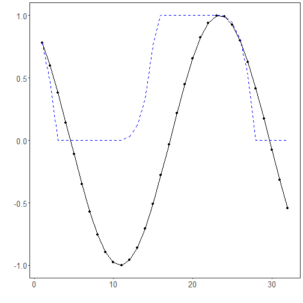

## Sliding-Window Min-Max Normalization

About the technique

- This strategy normalizes each window with its own local minimum and maximum.
- It emphasizes local shape over absolute level, which can help when amplitude varies through time.

Didactic goal: compare local scaling with global scaling and see what information each one keeps or removes.


``` r
source(url("https://raw.githubusercontent.com/cefet-rj-dal/tspredit/main/examples/seed.R"))
# Window-based Normalization (Min-Max)

# Installing the package (if needed)
#install.packages("tspredit")
```

We start by loading the packages used throughout this example.


``` r
library(daltoolbox)
library(tspredit)
library(ggplot2)
```

We load the example series that will be used throughout the demonstration.


``` r
data(tsd)
```

The first plot shows the original series. This is the common visual reference
for all normalization examples in this folder.


``` r
plot_ts(x = tsd$x, y = tsd$y) + theme(text = element_text(size = 16))
```


The next step organizes the series into sliding windows, which is the tabular
representation used by the later transformations and models.


``` r
sw_size <- 10
ts <- ts_data(tsd$y, sw_size)
ts_head(ts, 3)
```

```
##             t9        t8        t7        t6        t5        t4        t3
## [1,] 0.0000000 0.2474040 0.4794255 0.6816388 0.8414710 0.9489846 0.9974950
## [2,] 0.2474040 0.4794255 0.6816388 0.8414710 0.9489846 0.9974950 0.9839859
## [3,] 0.4794255 0.6816388 0.8414710 0.9489846 0.9974950 0.9839859 0.9092974
##             t2        t1        t0
## [1,] 0.9839859 0.9092974 0.7780732
## [2,] 0.9092974 0.7780732 0.5984721
## [3,] 0.7780732 0.5984721 0.3816610
```

``` r
summary(ts[, 10])
```

```
##        t0          
##  Min.   :-0.99929  
##  1st Qu.:-0.55091  
##  Median : 0.05397  
##  Mean   : 0.02988  
##  3rd Qu.: 0.63279  
##  Max.   : 0.99460
```

We now apply sliding-window min-max normalization and compare the supervised
target column (`t0`) before and after the transformation.


``` r
preproc <- ts_norm_swminmax()
set_example_seed()
preproc <- fit(preproc, ts)
tst <- transform(preproc, ts)
ts_head(tst, 3)
```

```
##             t9        t8        t7        t6        t5        t4        t3
## [1,] 0.0000000 0.2480253 0.4806295 0.6833506 0.8435842 0.9513678 1.0000000
## [2,] 0.0000000 0.3093246 0.5789095 0.7919932 0.9353274 1.0000000 0.9819901
## [3,] 0.1587515 0.4871082 0.7466460 0.9212282 1.0000000 0.9780638 0.8567835
##             t2        t1        t0
## [1,] 0.9864570 0.9115809 0.7800272
## [2,] 0.8824175 0.7074731 0.4680341
## [3,] 0.6436998 0.3520610 0.0000000
```

``` r
summary(tst[, 10])
```

```
##        t0        
##  Min.   :0.0000  
##  1st Qu.:0.0000  
##  Median :0.2264  
##  Mean   :0.4301  
##  3rd Qu.:0.9974  
##  Max.   :1.0000
```

``` r
compare_t0 <- rbind(
  data.frame(idx = seq_len(nrow(ts)), value = as.vector(ts[, ncol(ts)]), series = "original t0"),
  data.frame(idx = seq_len(nrow(tst)), value = as.vector(tst[, ncol(tst)]), series = "transformed t0")
)

plot_ts_pred(
  x = compare_t0[compare_t0$series == "original t0", "idx"],
  y = compare_t0[compare_t0$series == "original t0", "value"],
  yadj = compare_t0[compare_t0$series == "transformed t0", "value"]
) + theme(text = element_text(size = 16))
```



What to observe

- The transformed curve reacts to each local window rather than to one global scale.
- Compared with global min-max, this makes local patterns more comparable but removes more absolute-level information.

References

- C. M. Bishop (2006). Pattern Recognition and Machine Learning. Springer.
